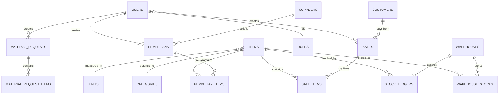
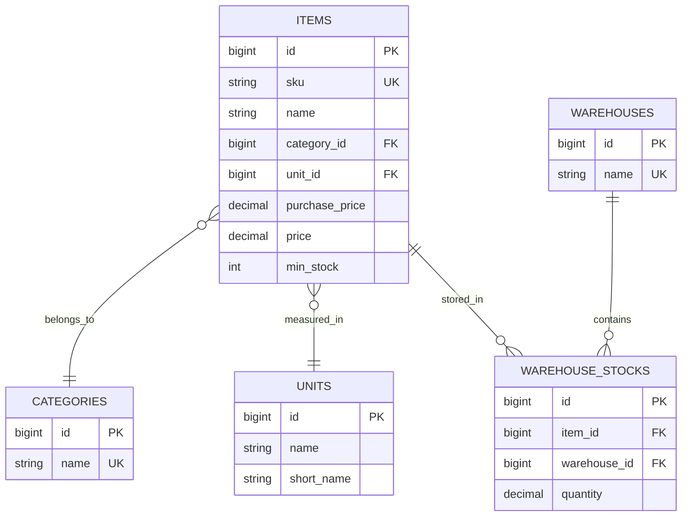
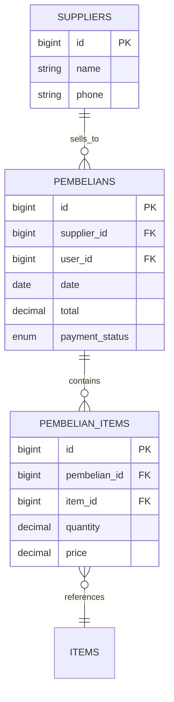
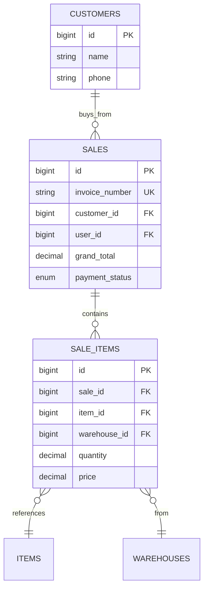
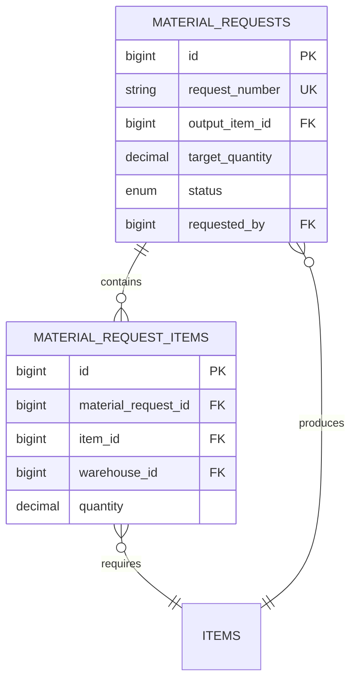

# ENTITY RELATIONSHIP DIAGRAM (ERD)

## Sistem Inventori PT NBC Indonesia

Dokumen ini menjelaskan struktur database lengkap dengan relasi antar tabel, constraint, dan index.

---

## 📊 ERD OVERVIEW (High-Level)



---

## 📋 DETAILED TABLE SPECIFICATIONS

### 1. USERS (Pengguna)

**Deskripsi:** Menyimpan data pengguna sistem  
**Primary Key:** `id`

| Column            | Type            | Constraint         | Description              |
| ----------------- | --------------- | ------------------ | ------------------------ |
| id                | BIGINT UNSIGNED | PK, AUTO_INCREMENT | ID unik pengguna         |
| name              | VARCHAR(255)    | NOT NULL           | Nama lengkap             |
| email             | VARCHAR(255)    | UNIQUE, NOT NULL   | Email login              |
| email_verified_at | TIMESTAMP       | NULLABLE           | Tanggal verifikasi email |
| password          | VARCHAR(255)    | NOT NULL           | Password (hashed)        |
| role_id           | BIGINT UNSIGNED | FK, NOT NULL       | Relasi ke roles          |
| is_active         | BOOLEAN         | DEFAULT TRUE       | Status aktif             |
| photo             | VARCHAR(255)    | NULLABLE           | Path foto profil         |
| remember_token    | VARCHAR(100)    | NULLABLE           | Token "Remember Me"      |
| created_at        | TIMESTAMP       | AUTO               | Tanggal dibuat           |
| updated_at        | TIMESTAMP       | AUTO               | Tanggal diupdate         |

**Indexes:**

-   PRIMARY: `id`
-   UNIQUE: `email`
-   INDEX: `role_id`

**Foreign Keys:**

-   `role_id` REFERENCES `roles(id)` ON DELETE RESTRICT

---

### 2. ROLES (Peran)

**Deskripsi:** Menyimpan peran pengguna dan izin akses  
**Primary Key:** `id`

| Column      | Type            | Constraint         | Description                     |
| ----------- | --------------- | ------------------ | ------------------------------- |
| id          | BIGINT UNSIGNED | PK, AUTO_INCREMENT | ID unik role                    |
| name        | VARCHAR(255)    | UNIQUE, NOT NULL   | Nama role (Admin, Finance, dll) |
| permissions | JSON            | NOT NULL           | Array permission                |
| description | TEXT            | NULLABLE           | Deskripsi role                  |
| created_at  | TIMESTAMP       | AUTO               | Tanggal dibuat                  |
| updated_at  | TIMESTAMP       | AUTO               | Tanggal diupdate                |

**Indexes:**

-   PRIMARY: `id`
-   UNIQUE: `name`

**Sample Data:**

```json
{
    "name": "Admin",
    "permissions": [
        "inventory.view",
        "inventory.create",
        "inventory.edit",
        "inventory.delete",
        "finance.view",
        "finance.create",
        "finance.edit",
        "finance.delete"
    ]
}
```

---

### 3. PASSWORD_RESET_TOKENS

**Deskripsi:** Token untuk reset password  
**Primary Key:** Composite (`email`, `token`)

| Column     | Type         | Constraint | Description           |
| ---------- | ------------ | ---------- | --------------------- |
| email      | VARCHAR(255) | NOT NULL   | Email pengguna        |
| token      | VARCHAR(255) | NOT NULL   | Token reset           |
| created_at | TIMESTAMP    | AUTO       | Waktu pembuatan token |

**Indexes:**

-   INDEX: `email`

---

### 4. CATEGORIES (Kategori Produk)

**Deskripsi:** Kategorisasi produk  
**Primary Key:** `id`

| Column      | Type            | Constraint         | Description        |
| ----------- | --------------- | ------------------ | ------------------ |
| id          | BIGINT UNSIGNED | PK, AUTO_INCREMENT | ID kategori        |
| name        | VARCHAR(255)    | UNIQUE, NOT NULL   | Nama kategori      |
| description | TEXT            | NULLABLE           | Deskripsi kategori |
| created_at  | TIMESTAMP       | AUTO               | Tanggal dibuat     |
| updated_at  | TIMESTAMP       | AUTO               | Tanggal diupdate   |

**Contoh:** Benang, Kain, Kimia, Aksesoris

---

### 5. UNITS (Satuan)

**Deskripsi:** Satuan ukuran barang  
**Primary Key:** `id`

| Column     | Type            | Constraint         | Description      |
| ---------- | --------------- | ------------------ | ---------------- |
| id         | BIGINT UNSIGNED | PK, AUTO_INCREMENT | ID satuan        |
| name       | VARCHAR(255)    | NOT NULL           | Nama satuan      |
| short_name | VARCHAR(50)     | NOT NULL           | Singkatan        |
| created_at | TIMESTAMP       | AUTO               | Tanggal dibuat   |
| updated_at | TIMESTAMP       | AUTO               | Tanggal diupdate |

**Contoh:** Kilogram (Kg), Pieces (Pcs), Meter (M)

---

### 6. WAREHOUSES (Gudang)

**Deskripsi:** Lokasi penyimpanan barang  
**Primary Key:** `id`

| Column     | Type            | Constraint         | Description      |
| ---------- | --------------- | ------------------ | ---------------- |
| id         | BIGINT UNSIGNED | PK, AUTO_INCREMENT | ID gudang        |
| name       | VARCHAR(255)    | UNIQUE, NOT NULL   | Nama gudang      |
| location   | VARCHAR(255)    | NULLABLE           | Alamat gudang    |
| pic        | VARCHAR(255)    | NULLABLE           | Person In Charge |
| created_at | TIMESTAMP       | AUTO               | Tanggal dibuat   |
| updated_at | TIMESTAMP       | AUTO               | Tanggal diupdate |

---

### 7. ITEMS (Produk/Barang)

**Deskripsi:** Master data produk  
**Primary Key:** `id`

| Column         | Type            | Constraint         | Description          |
| -------------- | --------------- | ------------------ | -------------------- |
| id             | BIGINT UNSIGNED | PK, AUTO_INCREMENT | ID produk            |
| name           | VARCHAR(255)    | NOT NULL           | Nama produk          |
| sku            | VARCHAR(255)    | UNIQUE, NOT NULL   | Stock Keeping Unit   |
| barcode        | VARCHAR(255)    | NULLABLE           | Barcode              |
| category_id    | BIGINT UNSIGNED | FK, NOT NULL       | Relasi ke categories |
| unit_id        | BIGINT UNSIGNED | FK, NOT NULL       | Relasi ke units      |
| purchase_price | DECIMAL(15,2)   | DEFAULT 0          | Harga beli           |
| price          | DECIMAL(15,2)   | DEFAULT 0          | Harga jual           |
| min_stock      | INTEGER         | DEFAULT 0          | Stok minimum (alert) |
| color          | VARCHAR(50)     | NULLABLE           | Warna (untuk kain)   |
| weight         | DECIMAL(10,2)   | NULLABLE           | Berat (untuk benang) |
| length         | DECIMAL(10,2)   | NULLABLE           | Panjang (untuk kain) |
| image          | VARCHAR(255)    | NULLABLE           | Path foto produk     |
| description    | TEXT            | NULLABLE           | Deskripsi produk     |
| is_active      | BOOLEAN         | DEFAULT TRUE       | Status aktif         |
| created_at     | TIMESTAMP       | AUTO               | Tanggal dibuat       |
| updated_at     | TIMESTAMP       | AUTO               | Tanggal diupdate     |
| deleted_at     | TIMESTAMP       | NULLABLE           | Soft delete          |

**Indexes:**

-   PRIMARY: `id`
-   UNIQUE: `sku`
-   INDEX: `category_id`, `unit_id`, `is_active`

**Foreign Keys:**

-   `category_id` REFERENCES `categories(id)` ON DELETE RESTRICT
-   `unit_id` REFERENCES `units(id)` ON DELETE RESTRICT

---

### 8. WAREHOUSE_STOCKS (Stok Per Gudang)

**Deskripsi:** Stok produk di setiap gudang  
**Primary Key:** `id`

| Column       | Type            | Constraint         | Description          |
| ------------ | --------------- | ------------------ | -------------------- |
| id           | BIGINT UNSIGNED | PK, AUTO_INCREMENT | ID record            |
| item_id      | BIGINT UNSIGNED | FK, NOT NULL       | Relasi ke items      |
| warehouse_id | BIGINT UNSIGNED | FK, NOT NULL       | Relasi ke warehouses |
| quantity     | DECIMAL(15,2)   | DEFAULT 0          | Jumlah stok          |
| created_at   | TIMESTAMP       | AUTO               | Tanggal dibuat       |
| updated_at   | TIMESTAMP       | AUTO               | Tanggal diupdate     |

**Indexes:**

-   PRIMARY: `id`
-   UNIQUE: Composite (`item_id`, `warehouse_id`)
-   INDEX: `item_id`, `warehouse_id`

**Foreign Keys:**

-   `item_id` REFERENCES `items(id)` ON DELETE CASCADE
-   `warehouse_id` REFERENCES `warehouses(id)` ON DELETE RESTRICT

**Business Rule:**

-   Setiap kombinasi item + warehouse hanya boleh 1 record
-   Quantity tidak boleh negatif (validated di application layer)

---

### 9. SUPPLIERS (Pemasok)

**Deskripsi:** Data supplier untuk pembelian  
**Primary Key:** `id`

| Column        | Type            | Constraint         | Description         |
| ------------- | --------------- | ------------------ | ------------------- |
| id            | BIGINT UNSIGNED | PK, AUTO_INCREMENT | ID supplier         |
| name          | VARCHAR(255)    | NOT NULL           | Nama supplier       |
| address       | TEXT            | NULLABLE           | Alamat              |
| phone         | VARCHAR(20)     | NULLABLE           | Nomor telepon       |
| email         | VARCHAR(255)    | NULLABLE           | Email               |
| pic           | VARCHAR(255)    | NULLABLE           | Contact person      |
| payment_terms | INTEGER         | DEFAULT 30         | Termin bayar (hari) |
| created_at    | TIMESTAMP       | AUTO               | Tanggal dibuat      |
| updated_at    | TIMESTAMP       | AUTO               | Tanggal diupdate    |

---

### 10. CUSTOMERS (Pelanggan)

**Deskripsi:** Data customer untuk penjualan  
**Primary Key:** `id`

| Column            | Type            | Constraint         | Description      |
| ----------------- | --------------- | ------------------ | ---------------- |
| id                | BIGINT UNSIGNED | PK, AUTO_INCREMENT | ID customer      |
| name              | VARCHAR(255)    | NOT NULL           | Nama customer    |
| address           | TEXT            | NULLABLE           | Alamat           |
| phone             | VARCHAR(20)     | NULLABLE           | Nomor telepon    |
| email             | VARCHAR(255)    | NULLABLE           | Email            |
| business_category | VARCHAR(255)    | NULLABLE           | Kategori bisnis  |
| created_at        | TIMESTAMP       | AUTO               | Tanggal dibuat   |
| updated_at        | TIMESTAMP       | AUTO               | Tanggal diupdate |

---

### 11. PEMBELIANS (Transaksi Pembelian)

**Deskripsi:** Header transaksi pembelian dari supplier  
**Primary Key:** `id`

| Column         | Type            | Constraint         | Description                 |
| -------------- | --------------- | ------------------ | --------------------------- |
| id             | BIGINT UNSIGNED | PK, AUTO_INCREMENT | ID pembelian                |
| supplier_id    | BIGINT UNSIGNED | FK, NOT NULL       | Relasi ke suppliers         |
| user_id        | BIGINT UNSIGNED | FK, NOT NULL       | User yang input             |
| invoice_number | VARCHAR(255)    | NULLABLE           | No. Invoice supplier        |
| date           | DATE            | NOT NULL           | Tanggal pembelian           |
| total          | DECIMAL(15,2)   | DEFAULT 0          | Total nilai                 |
| paid_amount    | DECIMAL(15,2)   | DEFAULT 0          | Jumlah dibayar              |
| payment_status | ENUM            | NOT NULL           | 'paid', 'partial', 'unpaid' |
| due_date       | DATE            | NULLABLE           | Jatuh tempo (jika hutang)   |
| notes          | TEXT            | NULLABLE           | Catatan                     |
| created_at     | TIMESTAMP       | AUTO               | Tanggal dibuat              |
| updated_at     | TIMESTAMP       | AUTO               | Tanggal diupdate            |

**Indexes:**

-   PRIMARY: `id`
-   INDEX: `supplier_id`, `user_id`, `date`, `payment_status`

**Foreign Keys:**

-   `supplier_id` REFERENCES `suppliers(id)` ON DELETE RESTRICT
-   `user_id` REFERENCES `users(id)` ON DELETE RESTRICT

**Computed Field:**

-   `debt = total - paid_amount`

---

### 12. PEMBELIAN_ITEMS (Detail Item Pembelian)

**Deskripsi:** Detail produk yang dibeli  
**Primary Key:** `id`

| Column       | Type            | Constraint         | Description          |
| ------------ | --------------- | ------------------ | -------------------- |
| id           | BIGINT UNSIGNED | PK, AUTO_INCREMENT | ID record            |
| pembelian_id | BIGINT UNSIGNED | FK, NOT NULL       | Relasi ke pembelians |
| item_id      | BIGINT UNSIGNED | FK, NOT NULL       | Relasi ke items      |
| quantity     | DECIMAL(15,2)   | NOT NULL           | Jumlah dibeli        |
| price        | DECIMAL(15,2)   | NOT NULL           | Harga beli per unit  |
| subtotal     | DECIMAL(15,2)   | NOT NULL           | Qty × Price          |
| created_at   | TIMESTAMP       | AUTO               | Tanggal dibuat       |
| updated_at   | TIMESTAMP       | AUTO               | Tanggal diupdate     |

**Indexes:**

-   PRIMARY: `id`
-   INDEX: `pembelian_id`, `item_id`

**Foreign Keys:**

-   `pembelian_id` REFERENCES `pembelians(id)` ON DELETE CASCADE
-   `item_id` REFERENCES `items(id)` ON DELETE RESTRICT

---

### 13. SALES (Transaksi Penjualan)

**Deskripsi:** Header transaksi penjualan ke customer  
**Primary Key:** `id`

| Column         | Type            | Constraint         | Description                    |
| -------------- | --------------- | ------------------ | ------------------------------ |
| id             | BIGINT UNSIGNED | PK, AUTO_INCREMENT | ID penjualan                   |
| customer_id    | BIGINT UNSIGNED | FK, NOT NULL       | Relasi ke customers            |
| user_id        | BIGINT UNSIGNED | FK, NOT NULL       | Sales yang input               |
| invoice_number | VARCHAR(255)    | UNIQUE, NOT NULL   | No. Invoice (INV-YYYYMMDD-XXX) |
| date           | DATE            | NOT NULL           | Tanggal penjualan              |
| subtotal       | DECIMAL(15,2)   | DEFAULT 0          | Total sebelum diskon           |
| discount_type  | ENUM            | DEFAULT 'percent'  | 'percent' atau 'fixed'         |
| discount_value | DECIMAL(15,2)   | DEFAULT 0          | Nilai diskon                   |
| tax            | DECIMAL(15,2)   | DEFAULT 0          | Pajak (PPN)                    |
| grand_total    | DECIMAL(15,2)   | DEFAULT 0          | Total akhir                    |
| paid_amount    | DECIMAL(15,2)   | DEFAULT 0          | Jumlah dibayar                 |
| change         | DECIMAL(15,2)   | DEFAULT 0          | Kembalian                      |
| payment_status | ENUM            | NOT NULL           | 'paid', 'partial', 'unpaid'    |
| due_date       | DATE            | NULLABLE           | Jatuh tempo piutang            |
| notes          | TEXT            | NULLABLE           | Catatan                        |
| created_at     | TIMESTAMP       | AUTO               | Tanggal dibuat                 |
| updated_at     | TIMESTAMP       | AUTO               | Tanggal diupdate               |

**Indexes:**

-   PRIMARY: `id`
-   UNIQUE: `invoice_number`
-   INDEX: `customer_id`, `user_id`, `date`, `payment_status`

**Foreign Keys:**

-   `customer_id` REFERENCES `customers(id)` ON DELETE RESTRICT
-   `user_id` REFERENCES `users(id)` ON DELETE RESTRICT

**Computed Field:**

-   `receivable = grand_total - paid_amount`

---

### 14. SALE_ITEMS (Detail Item Penjualan)

**Deskripsi:** Detail produk yang dijual  
**Primary Key:** `id`

| Column       | Type            | Constraint         | Description         |
| ------------ | --------------- | ------------------ | ------------------- |
| id           | BIGINT UNSIGNED | PK, AUTO_INCREMENT | ID record           |
| sale_id      | BIGINT UNSIGNED | FK, NOT NULL       | Relasi ke sales     |
| item_id      | BIGINT UNSIGNED | FK, NOT NULL       | Relasi ke items     |
| warehouse_id | BIGINT UNSIGNED | FK, NOT NULL       | Gudang sumber       |
| quantity     | DECIMAL(15,2)   | NOT NULL           | Jumlah dijual       |
| price        | DECIMAL(15,2)   | NOT NULL           | Harga jual per unit |
| subtotal     | DECIMAL(15,2)   | NOT NULL           | Qty × Price         |
| created_at   | TIMESTAMP       | AUTO               | Tanggal dibuat      |
| updated_at   | TIMESTAMP       | AUTO               | Tanggal diupdate    |

**Indexes:**

-   PRIMARY: `id`
-   INDEX: `sale_id`, `item_id`, `warehouse_id`

**Foreign Keys:**

-   `sale_id` REFERENCES `sales(id)` ON DELETE CASCADE
-   `item_id` REFERENCES `items(id)` ON DELETE RESTRICT
-   `warehouse_id` REFERENCES `warehouses(id)` ON DELETE RESTRICT

---

### 15. STOCK_LEDGERS (Jurnal Stok)

**Deskripsi:** Log histori semua mutasi stok  
**Primary Key:** `id`

| Column           | Type            | Constraint         | Description          |
| ---------------- | --------------- | ------------------ | -------------------- |
| id               | BIGINT UNSIGNED | PK, AUTO_INCREMENT | ID record            |
| item_id          | BIGINT UNSIGNED | FK, NOT NULL       | Relasi ke items      |
| warehouse_id     | BIGINT UNSIGNED | FK, NOT NULL       | Relasi ke warehouses |
| type             | VARCHAR(50)     | NOT NULL           | Jenis mutasi         |
| quantity         | DECIMAL(15,2)   | NOT NULL           | Jumlah (+/-)         |
| balance          | DECIMAL(15,2)   | NOT NULL           | Saldo setelah mutasi |
| reference_type   | VARCHAR(255)    | NULLABLE           | Polymorphic type     |
| reference_id     | BIGINT UNSIGNED | NULLABLE           | Polymorphic ID       |
| notes            | TEXT            | NULLABLE           | Catatan              |
| user_id          | BIGINT UNSIGNED | FK, NOT NULL       | User yang buat       |
| transaction_date | DATETIME        | NOT NULL           | Waktu transaksi      |
| created_at       | TIMESTAMP       | AUTO               | Tanggal dibuat       |

**Type Values:**

-   `IN` - Masuk (Pembelian)
-   `OUT` - Keluar (Penjualan)
-   `TRANSFER_IN` - Transfer masuk
-   `TRANSFER_OUT` - Transfer keluar
-   `ADJUSTMENT` - Penyesuaian
-   `PRODUCTION_IN` - Hasil produksi
-   `PRODUCTION_OUT` - Bahan baku terpakai

**Indexes:**

-   PRIMARY: `id`
-   INDEX: `item_id`, `warehouse_id`, `type`, `transaction_date`
-   INDEX: Composite (`reference_type`, `reference_id`)

**Foreign Keys:**

-   `item_id` REFERENCES `items(id)` ON DELETE RESTRICT
-   `warehouse_id` REFERENCES `warehouses(id)` ON DELETE RESTRICT
-   `user_id` REFERENCES `users(id)` ON DELETE RESTRICT

**Polymorphic Relation:**

-   `reference_type` + `reference_id` → Bisa ke `sales`, `pembelians`, `material_requests`, `stock_adjustments`

---

### 16. STOCK_ADJUSTMENTS (Penyesuaian Stok)

**Deskripsi:** Koreksi stok manual  
**Primary Key:** `id`

| Column         | Type            | Constraint         | Description                       |
| -------------- | --------------- | ------------------ | --------------------------------- |
| id             | BIGINT UNSIGNED | PK, AUTO_INCREMENT | ID adjustment                     |
| item_id        | BIGINT UNSIGNED | FK, NOT NULL       | Relasi ke items                   |
| warehouse_id   | BIGINT UNSIGNED | FK, NOT NULL       | Relasi ke warehouses              |
| system_stock   | DECIMAL(15,2)   | NOT NULL           | Stok sistem                       |
| physical_stock | DECIMAL(15,2)   | NOT NULL           | Stok fisik                        |
| difference     | DECIMAL(15,2)   | NOT NULL           | Selisih                           |
| reason         | TEXT            | NOT NULL           | Alasan adjustment                 |
| status         | ENUM            | DEFAULT 'pending'  | 'pending', 'approved', 'rejected' |
| approved_by    | BIGINT UNSIGNED | FK, NULLABLE       | User yang approve                 |
| approved_at    | TIMESTAMP       | NULLABLE           | Waktu approve                     |
| created_by     | BIGINT UNSIGNED | FK, NOT NULL       | User yang buat                    |
| created_at     | TIMESTAMP       | AUTO               | Tanggal dibuat                    |
| updated_at     | TIMESTAMP       | AUTO               | Tanggal diupdate                  |

**Indexes:**

-   PRIMARY: `id`
-   INDEX: `item_id`, `warehouse_id`, `status`

**Foreign Keys:**

-   `item_id` REFERENCES `items(id)` ON DELETE RESTRICT
-   `warehouse_id` REFERENCES `warehouses(id)` ON DELETE RESTRICT
-   `approved_by` REFERENCES `users(id)` ON DELETE SET NULL
-   `created_by` REFERENCES `users(id)` ON DELETE RESTRICT

---

### 17. MATERIAL_REQUESTS (Permintaan Material)

**Deskripsi:** Request bahan baku untuk produksi (PPIC)  
**Primary Key:** `id`

| Column          | Type            | Constraint         | Description                   |
| --------------- | --------------- | ------------------ | ----------------------------- |
| id              | BIGINT UNSIGNED | PK, AUTO_INCREMENT | ID request                    |
| request_number  | VARCHAR(255)    | UNIQUE, NOT NULL   | No. Request (MR-YYYYMMDD-XXX) |
| output_item_id  | BIGINT UNSIGNED | FK, NOT NULL       | Produk jadi yang akan dibuat  |
| target_quantity | DECIMAL(15,2)   | NOT NULL           | Target qty produksi           |
| actual_quantity | DECIMAL(15,2)   | DEFAULT 0          | Hasil aktual                  |
| status          | ENUM            | DEFAULT 'pending'  | Status workflow               |
| requested_by    | BIGINT UNSIGNED | FK, NOT NULL       | PPIC yang request             |
| approved_by     | BIGINT UNSIGNED | FK, NULLABLE       | Warehouse yang approve        |
| started_at      | TIMESTAMP       | NULLABLE           | Waktu mulai produksi          |
| finished_at     | TIMESTAMP       | NULLABLE           | Waktu selesai                 |
| notes           | TEXT            | NULLABLE           | Catatan                       |
| created_at      | TIMESTAMP       | AUTO               | Tanggal dibuat                |
| updated_at      | TIMESTAMP       | AUTO               | Tanggal diupdate              |

**Status Values:**

-   `pending` - Menunggu approval Warehouse
-   `approved` - Warehouse sudah approve
-   `ready` - Barang siap diambil
-   `in_production` - Sedang proses produksi
-   `finished` - Selesai
-   `rejected` - Ditolak Warehouse

**Indexes:**

-   PRIMARY: `id`
-   UNIQUE: `request_number`
-   INDEX: `output_item_id`, `status`, `requested_by`

**Foreign Keys:**

-   `output_item_id` REFERENCES `items(id)` ON DELETE RESTRICT
-   `requested_by` REFERENCES `users(id)` ON DELETE RESTRICT
-   `approved_by` REFERENCES `users(id)` ON DELETE SET NULL

---

### 18. MATERIAL_REQUEST_ITEMS (Detail Bahan Baku)

**Deskripsi:** Bahan baku yang dibutuhkan untuk produksi  
**Primary Key:** `id`

| Column              | Type            | Constraint         | Description                 |
| ------------------- | --------------- | ------------------ | --------------------------- |
| id                  | BIGINT UNSIGNED | PK, AUTO_INCREMENT | ID record                   |
| material_request_id | BIGINT UNSIGNED | FK, NOT NULL       | Relasi ke material_requests |
| item_id             | BIGINT UNSIGNED | FK, NOT NULL       | Bahan baku                  |
| warehouse_id        | BIGINT UNSIGNED | FK, NOT NULL       | Gudang sumber               |
| quantity            | DECIMAL(15,2)   | NOT NULL           | Qty yang diminta            |
| created_at          | TIMESTAMP       | AUTO               | Tanggal dibuat              |
| updated_at          | TIMESTAMP       | AUTO               | Tanggal diupdate            |

**Indexes:**

-   PRIMARY: `id`
-   INDEX: `material_request_id`, `item_id`, `warehouse_id`

**Foreign Keys:**

-   `material_request_id` REFERENCES `material_requests(id)` ON DELETE CASCADE
-   `item_id` REFERENCES `items(id)` ON DELETE RESTRICT
-   `warehouse_id` REFERENCES `warehouses(id)` ON DELETE RESTRICT

---

### 19. CASH_FLOWS (Arus Kas)

**Deskripsi:** Log semua transaksi kas  
**Primary Key:** `id`

| Column           | Type            | Constraint         | Description                          |
| ---------------- | --------------- | ------------------ | ------------------------------------ |
| id               | BIGINT UNSIGNED | PK, AUTO_INCREMENT | ID cash flow                         |
| type             | ENUM            | NOT NULL           | 'in' atau 'out'                      |
| amount           | DECIMAL(15,2)   | NOT NULL           | Jumlah uang                          |
| transaction_date | DATE            | NOT NULL           | Tanggal transaksi                    |
| category         | VARCHAR(255)    | NOT NULL           | Kategori (Penjualan, Pembelian, dll) |
| reference_type   | VARCHAR(255)    | NULLABLE           | Polymorphic type                     |
| reference_id     | BIGINT UNSIGNED | NULLABLE           | Polymorphic ID                       |
| notes            | TEXT            | NULLABLE           | Catatan                              |
| user_id          | BIGINT UNSIGNED | FK, NOT NULL       | User yang catat                      |
| created_at       | TIMESTAMP       | AUTO               | Tanggal dibuat                       |
| updated_at       | TIMESTAMP       | AUTO               | Tanggal diupdate                     |

**Indexes:**

-   PRIMARY: `id`
-   INDEX: `type`, `transaction_date`, `category`
-   INDEX: Composite (`reference_type`, `reference_id`)

**Foreign Keys:**

-   `user_id` REFERENCES `users(id)` ON DELETE RESTRICT

---

### 20. EXPENSES (Pengeluaran)

**Deskripsi:** Biaya operasional di luar pembelian  
**Primary Key:** `id`

| Column      | Type            | Constraint         | Description                   |
| ----------- | --------------- | ------------------ | ----------------------------- |
| id          | BIGINT UNSIGNED | PK, AUTO_INCREMENT | ID expense                    |
| date        | DATE            | NOT NULL           | Tanggal pengeluaran           |
| category    | VARCHAR(255)    | NOT NULL           | Kategori (Listrik, Gaji, dll) |
| description | TEXT            | NOT NULL           | Deskripsi                     |
| amount      | DECIMAL(15,2)   | NOT NULL           | Jumlah                        |
| receipt     | VARCHAR(255)    | NULLABLE           | Bukti/foto struk              |
| user_id     | BIGINT UNSIGNED | FK, NOT NULL       | User yang input               |
| created_at  | TIMESTAMP       | AUTO               | Tanggal dibuat                |
| updated_at  | TIMESTAMP       | AUTO               | Tanggal diupdate              |

**Indexes:**

-   PRIMARY: `id`
-   INDEX: `date`, `category`, `user_id`

**Foreign Keys:**

-   `user_id` REFERENCES `users(id)` ON DELETE RESTRICT

---

### 21. COMPANIES (Profil Perusahaan)

**Deskripsi:** Data perusahaan untuk print invoice/laporan  
**Primary Key:** `id`

| Column     | Type            | Constraint         | Description      |
| ---------- | --------------- | ------------------ | ---------------- |
| id         | BIGINT UNSIGNED | PK, AUTO_INCREMENT | ID (selalu 1)    |
| name       | VARCHAR(255)    | NOT NULL           | Nama perusahaan  |
| address    | TEXT            | NULLABLE           | Alamat           |
| phone      | VARCHAR(20)     | NULLABLE           | Telepon          |
| email      | VARCHAR(255)    | NULLABLE           | Email            |
| logo       | VARCHAR(255)    | NULLABLE           | Path logo        |
| favicon    | VARCHAR(255)    | NULLABLE           | Path favicon     |
| footer     | TEXT            | NULLABLE           | Footer invoice   |
| created_at | TIMESTAMP       | AUTO               | Tanggal dibuat   |
| updated_at | TIMESTAMP       | AUTO               | Tanggal diupdate |

**Note:** Tabel ini hanya berisi 1 record (singleton)

---

## 🔗 RELATIONSHIP SUMMARY

### One-to-Many Relationships

| Parent            | Child                  | Relationship                      |
| ----------------- | ---------------------- | --------------------------------- |
| roles             | users                  | 1 role → many users               |
| categories        | items                  | 1 kategori → many items           |
| units             | items                  | 1 satuan → many items             |
| items             | warehouse_stocks       | 1 item → many stocks (per gudang) |
| warehouses        | warehouse_stocks       | 1 gudang → many stocks            |
| suppliers         | pembelians             | 1 supplier → many pembelians      |
| customers         | sales                  | 1 customer → many sales           |
| users             | sales                  | 1 user → many sales               |
| users             | pembelians             | 1 user → many pembelians          |
| sales             | sale_items             | 1 sale → many items               |
| pembelians        | pembelian_items        | 1 pembelian → many items          |
| material_requests | material_request_items | 1 request → many items            |

### Polymorphic Relationships

| Polymorphic Owner | Related To                           | Via Fields                    |
| ----------------- | ------------------------------------ | ----------------------------- |
| stock_ledgers     | sales, pembelians, material_requests | reference_type + reference_id |
| cash_flows        | sales, pembelians, expenses          | reference_type + reference_id |

---

## 🗃️ INDEX STRATEGY

### Indexes untuk Performance

**High-Priority Indexes:**

1. `items.sku` (UNIQUE) - Untuk search produk
2. `sales.invoice_number` (UNIQUE) - Lookup invoice
3. Composite (`warehouse_stocks.item_id`, `warehouse_stocks.warehouse_id`) - Cek stok
4. `stock_ledgers.transaction_date` - Filter by date
5. `sale_items.sale_id` - Join optimization
6. `pembelian_items.pembelian_id` - Join optimization

**Query Optimization Examples:**

```sql
-- Cek stok produk di gudang tertentu (fast)
SELECT quantity
FROM warehouse_stocks
WHERE item_id = ? AND warehouse_id = ?;

-- Get invoice detail (fast)
SELECT * FROM sales WHERE invoice_number = ?;

-- Stock ledger by date range (fast)
SELECT * FROM stock_ledgers
WHERE transaction_date BETWEEN ? AND ?
AND item_id = ?;
```

---

## 🔒 DATA INTEGRITY CONSTRAINTS

### Constraint Rules

1. **Prevent Negative Stock:**

    - Validasi di application layer sebelum update
    - Check constraint: `quantity >= 0`

2. **Cascade Delete Protection:**

    - Produk yang pernah ditransaksikan tidak bisa dihapus (soft delete)
    - Foreign key ON DELETE RESTRICT untuk referential integrity

3. **Unique Constraints:**

    - `users.email` - Tidak boleh duplikat
    - `items.sku` - SKU unik per produk
    - `sales.invoice_number` - Invoice unik
    - Composite (`warehouse_stocks.item_id`, `warehouse_stocks.warehouse_id`)

4. **Required Fields:**
    - Transaksi wajib punya user_id (audit trail)
    - Stock ledger wajib punya transaction_date
    - Pembelian/Penjualan wajib punya minimal 1 item

---

## 📊 ERD DETAIL PER MODUL

### Modul Inventory



### Modul Procurement



### Modul Sales



### Modul Production (PPIC)



---

## 💾 SAMPLE DATA

### Insert Sample Data (Untuk Testing)

```sql
-- Roles
INSERT INTO roles (name, permissions) VALUES
('Admin', '["inventory.view","inventory.create","inventory.edit","inventory.delete","finance.view"]'),
('Finance', '["finance.view","finance.create"]'),
('Warehouse', '["inventory.view","inventory.create","inventory.edit"]');

-- Categories
INSERT INTO categories (name) VALUES
('Benang'), ('Kain'), ('Kimia'), ('Aksesoris');

-- Units
INSERT INTO units (name, short_name) VALUES
('Kilogram', 'Kg'),
('Pieces', 'Pcs'),
('Meter', 'M'),
('Roll', 'Roll');

-- Warehouses
INSERT INTO warehouses (name, location) VALUES
('Gudang Utama', 'Jakarta'),
('Gudang Bahan Baku', 'Bandung');

-- Users
INSERT INTO users (name, email, password, role_id) VALUES
('Admin', 'admin@ptNBC.com', '$2y$10$...hashed...', 1);

-- Items
INSERT INTO items (name, sku, category_id, unit_id, purchase_price, price) VALUES
('Benang Cotton 20s', 'BNG-CTN-001', 1, 1, 50000, 60000);
```

---

## 🔧 MAINTENANCE & OPTIMIZATION

### Monitoring Queries

```sql
-- Produk dengan stok rendah
SELECT i.name, i.min_stock, SUM(ws.quantity) as total_stock
FROM items i
LEFT JOIN warehouse_stocks ws ON i.id = ws.item_id
GROUP BY i.id
HAVING total_stock < i.min_stock;

-- Dead Stock (tidak terjual 90 hari)
SELECT i.name, i.sku, MAX(s.date) as last_sold
FROM items i
LEFT JOIN sale_items si ON i.id = si.item_id
LEFT JOIN sales s ON si.sale_id = s.id
GROUP BY i.id
HAVING last_sold < DATE_SUB(NOW(), INTERVAL 90 DAY)
OR last_sold IS NULL;

-- Hutang Overdue
SELECT p.id, s.name as supplier, p.total, p.paid_amount,
       (p.total - p.paid_amount) as debt, p.due_date
FROM pembelians p
JOIN suppliers s ON p.supplier_id = s.id
WHERE p.payment_status != 'paid'
AND p.due_date < CURDATE();
```

---

**Versi Dokumen:** 1.0  
**Terakhir Diperbarui:** 30 Desember 2025  
**Database:** MySQL 8.0+  
**Charset:** utf8mb4_unicode_ci

---

_"Database yang baik adalah fondasi aplikasi yang solid"_
