# FLOWMAP SISTEM YANG DIUSULKAN

## Sistem Inventori PT NBC Indonesia

Dokumen ini menjelaskan alur proses bisnis lengkap untuk sistem yang diusulkan dengan diagram flowmap menggunakan Mermaid.

---

## 📋 DAFTAR ISI

1. [Flowmap Procurement (Pengadaan Barang)](#1-flowmap-procurement)
2. [Flowmap Sales (Penjualan)](#2-flowmap-sales)
3. [Flowmap Production (Produksi PPIC)](#3-flowmap-production)
4. [Flowmap Inventory Management](#4-flowmap-inventory-management)
5. [Flowmap Finance Management](#5-flowmap-finance-management)
6. [Flowmap User Management](#6-flowmap-user-management)

---

## 1. FLOWMAP PROCUREMENT (Pengadaan Barang)

### 1.1 Proses Pembelian dari Supplier

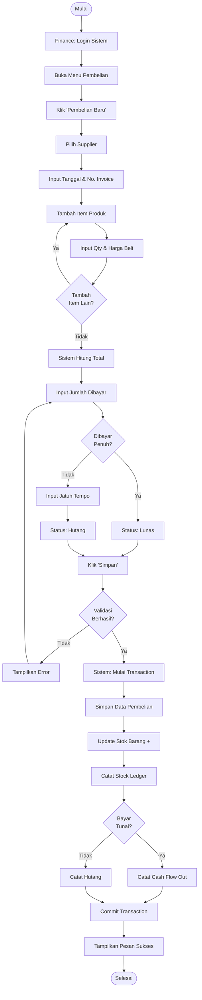

### 1.2 Proses Pembayaran Hutang

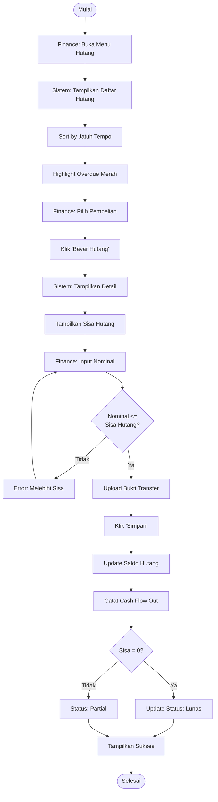

---

## 2. FLOWMAP SALES (Penjualan)

### 2.1 Proses Penjualan ke Customer

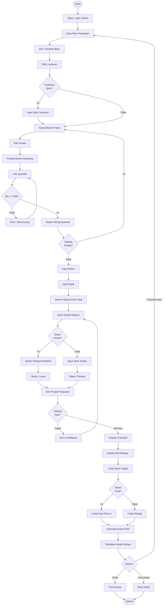

### 2.2 Proses Retur Penjualan

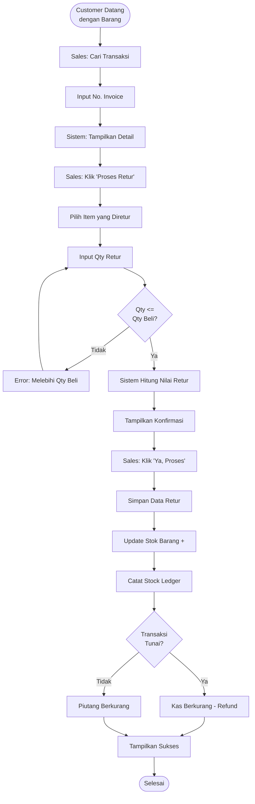

---

## 3. FLOWMAP PRODUCTION (PPIC)

### 3.1 Alur Material Request (End-to-End)

```mermaid
flowchart TD
    Start([Mulai]) --> A[PPIC: Login Sistem]
    A --> B[Buka Menu Material Request]
    B --> C[Klik 'Request Baru']
    C --> D[Pilih Produk Jadi]
    D --> E[Input Target Qty]
    E --> F[Tambah Bahan Baku]
    F --> G[Pilih Item & Warehouse]
    G --> H[Input Qty Bahan]
    H --> I{Tambah<br/>Bahan Lain?}
    I -->|Ya| F
    I -->|Tidak| J[Klik 'Submit Request']
    J --> K[Status: Pending]
    K --> L[Notifikasi ke Warehouse]

    L --> M[Warehouse: Buka Notifikasi]
    M --> N[Cek Ketersediaan Stok]
    N --> O{Stok<br/>Cukup?}
    O -->|Tidak| P[Klik 'Tolak']
    P --> Q[Input Alasan]
    Q --> R[Status: Rejected]
    R --> S[Notifikasi ke PPIC]
    S --> End1([Selesai - Ditolak])

    O -->|Ya| T[Siapkan Barang Fisik]
    T --> U[Klik 'Siapkan']
    U --> V[Status: Ready]
    V --> W[Notifikasi ke PPIC]

    W --> X[Produksi: Ambil Barang]
    X --> Y[PPIC: Klik 'Mulai Produksi']
    Y --> Z[Sistem: Update Status]
    Z --> AA[Status: In Production]
    AA --> AB[Update Stok Bahan -]
    AB --> AC[Catat Stock Ledger]

    AC --> AD[Proses Fisik Produksi...]
    AD --> AE[PPIC: Klik 'Selesaikan']
    AE --> AF[Input Qty Hasil Aktual]
    AF --> AG[Update Stok Jadi +]
    AG --> AH[Catat Stock Ledger]
    AH --> AI[Status: Finished]
    AI --> AJ[Hitung Efisiensi]
    AJ --> End2([Selesai - Sukses])
```

---

## 4. FLOWMAP INVENTORY MANAGEMENT

### 4.1 Transfer Stok Antar Gudang

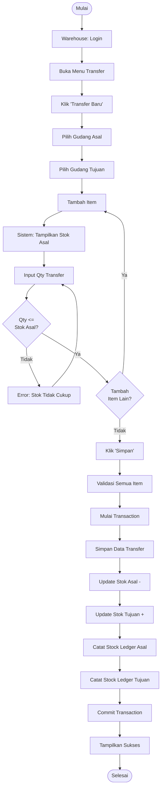

### 4.2 Stock Adjustment (Koreksi Stok)

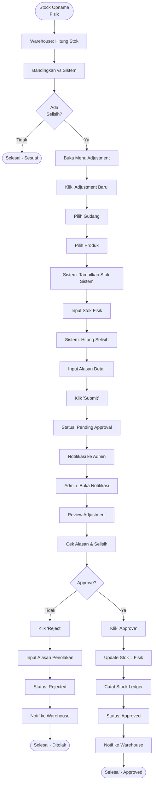

---

## 5. FLOWMAP FINANCE MANAGEMENT

### 5.1 Monitoring Dashboard Keuangan

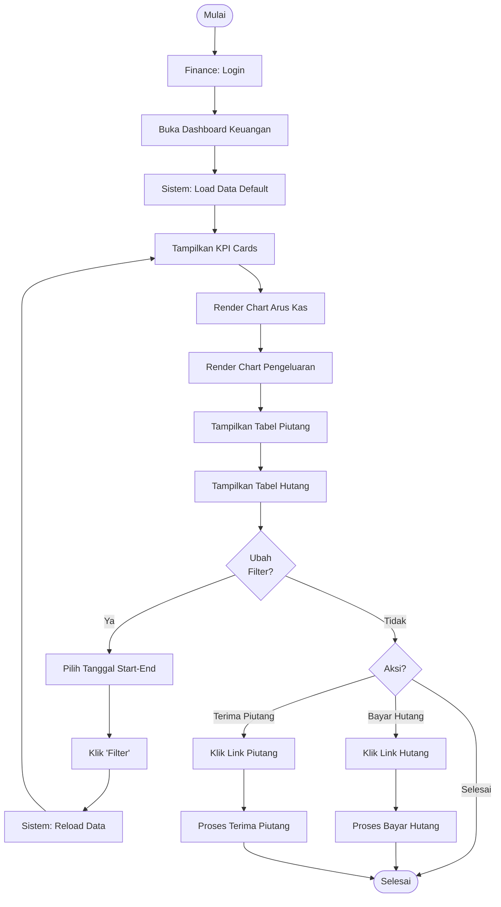

### 5.2 Rekonsiliasi Cash Flow Bulanan

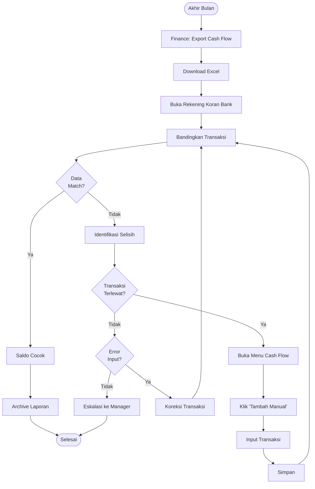

---

## 6. FLOWMAP USER MANAGEMENT

### 6.1 Tambah User Baru & Assign Role

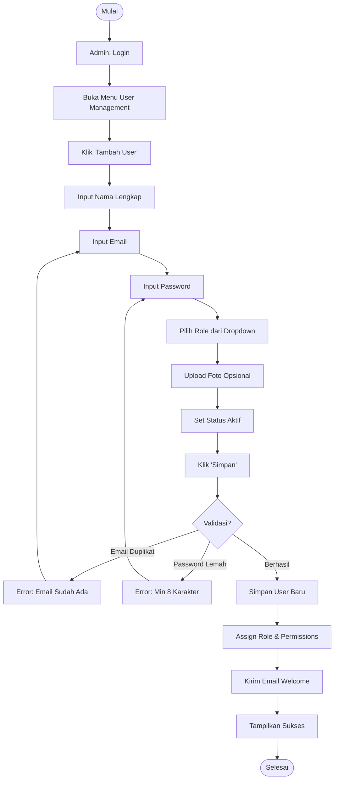

### 6.2 Reset Password User

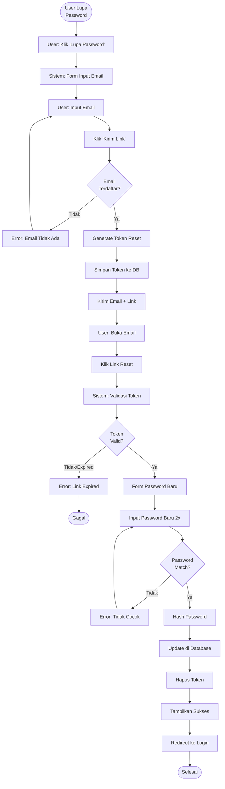

---

## 7. FLOWMAP LAPORAN

### 7.1 Generate Laporan Valuasi Stok

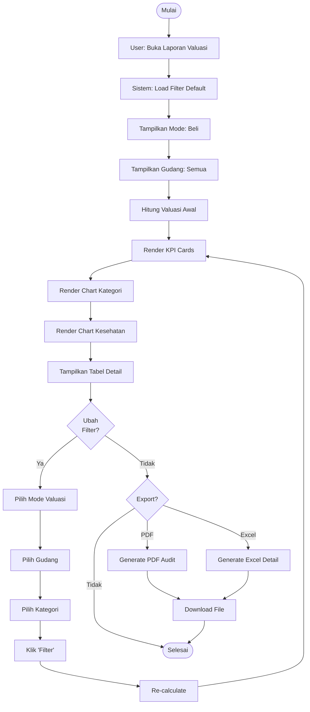

### 7.2 View Stock Ledger (Jurnal Stok)

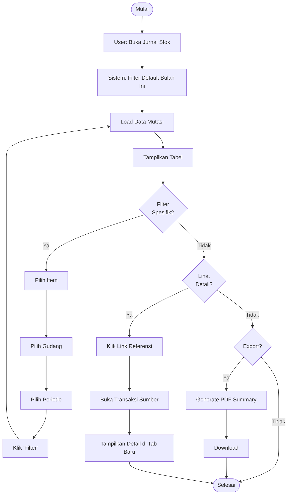

---

## 8. LEGEND & NOTASI

### Simbol Flowchart

| Simbol    | Keterangan           |
| --------- | -------------------- |
| `([...])` | Terminal (Start/End) |
| `[...]`   | Proses/Aksi          |
| `{...}`   | Keputusan (Decision) |
| `[(...)`  | Database Operation   |
| `-->`     | Alur Normal          |
| `-.->`    | Alur Alternatif      |

### Aktor dalam Flowmap

-   **Admin:** Pengguna dengan akses penuh
-   **Finance:** Departemen keuangan
-   **Warehouse:** Staff gudang
-   **Sales:** Kasir/penjual
-   **PPIC:** Production planning
-   **Sistem:** Aksi otomatis oleh aplikasi

---

## 9. PERBANDINGAN SISTEM LAMA vs BARU

### 9.1 Proses Pembelian

| Aspek        | Sistem Lama     | Sistem Baru (Usulan)          |
| ------------ | --------------- | ----------------------------- |
| Input Data   | Manual di Excel | Form digital di sistem        |
| Update Stok  | Manual hitung   | Otomatis real-time            |
| Hutang       | Catat terpisah  | Terintegrasi & auto-calculate |
| Laporan      | Export manual   | Generate otomatis             |
| Waktu Proses | 15-30 menit     | 3-5 menit                     |

### 9.2 Proses Stock Opname

| Aspek         | Sistem Lama        | Sistem Baru (Usulan)            |
| ------------- | ------------------ | ------------------------------- |
| Cetak Laporan | Excel manual       | 1 klik PDF                      |
| Adjustment    | Input ulang manual | Form digital dengan approval    |
| Audit Trail   | Tidak ada          | Lengkap dengan timestamp & user |
| Waktu Opname  | 1 hari             | 4-6 jam                         |

---

## 10. INTEGRASI ANTAR MODUL

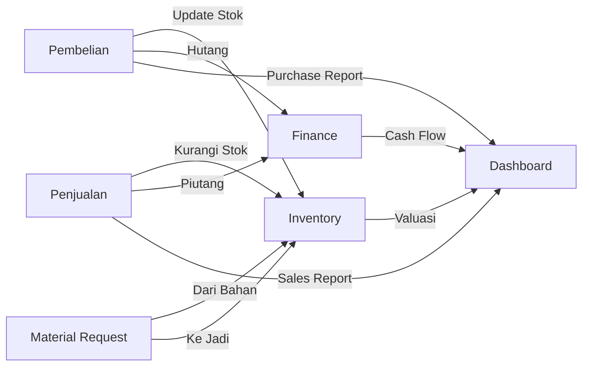

---

## 11. KEUNGGULAN SISTEM USULAN

### Otomatisasi

-   ✅ Stok update otomatis setiap transaksi
-   ✅ Hutang/Piutang tercatat otomatis
-   ✅ Cash Flow terupdate real-time
-   ✅ Invoice auto-generate

### Akurasi

-   ✅ Minim human error
-   ✅ Validasi di setiap input
-   ✅ Foreign key constraint
-   ✅ Transaction rollback on error

### Kecepatan

-   ✅ Proses 5x lebih cepat
-   ✅ Laporan instan
-   ✅ Search & filter cepat
-   ✅ Responsive UI

### Kontrol

-   ✅ RBAC (hak akses per role)
-   ✅ Approval workflow
-   ✅ Audit trail lengkap
-   ✅ Multi-user concurrent access

---

**Versi Dokumen:** 1.0  
**Terakhir Diperbarui:** 30 Desember 2025  
**Penyusun:** PT NBC Indonesia IT Department

---

_"Flowmap yang jelas adalah kunci implementasi yang sukses"_
