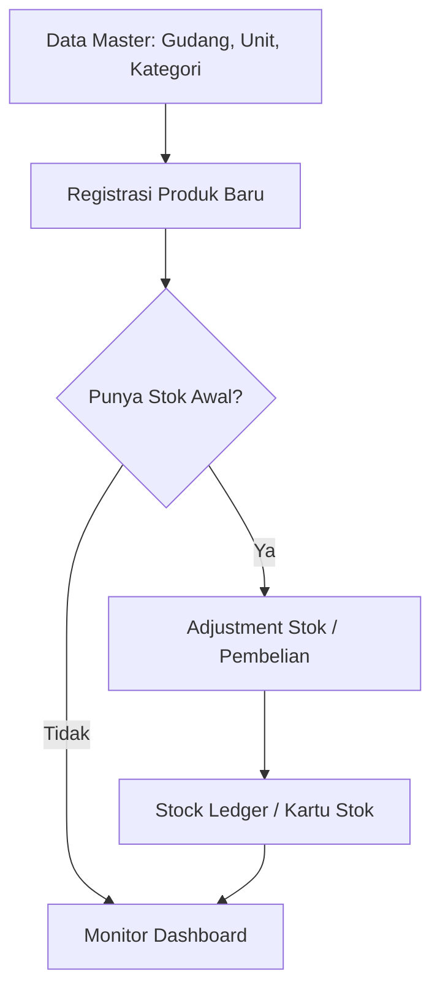
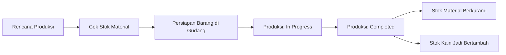

<p align="center">
  
</p>

<h1 align="center">🏭 Sistem Inventori & Produksi Tekstil</h1>

<p align="center">
  <strong>PT NBC Indonesia - Enterprise Resource Planning untuk Manufaktur Tekstil</strong>
</p>

<p align="center">
  
  
  
  
</p>

---

## 📋 Daftar Isi

-   [Tentang Sistem](#-tentang-sistem)
-   [Fitur Utama](#-fitur-utama)
-   [Teknologi](#-teknologi)
-   [Persyaratan Sistem](#-persyaratan-sistem)
-   [Instalasi](#-instalasi)
-   [Konfigurasi](#-konfigurasi)
-   [Struktur Direktori](#-struktur-direktori)
-   [Modul Sistem](#-modul-sistem)
-   [Role & Permissions](#-role--permissions)
-   [API & Integrasi](#-api--integrasi)
-   [Perintah Artisan](#-perintah-artisan)
-   [Testing](#-testing)
-   [Deployment](#-deployment)
-   [Dokumentasi Tambahan](#-dokumentasi-tambahan)
-   [Troubleshooting](#-troubleshooting)
-   [Kontribusi](#-kontribusi)
-   [Lisensi](#-lisensi)
-   [Kontak](#-kontak)

---

## 🏢 Tentang Sistem

**Sistem Inventori & Produksi Tekstil** adalah aplikasi web enterprise yang dirancang khusus untuk PT NBC Indonesia dalam mengelola:

-   📦 **Inventori** - Manajemen stok bahan baku dan produk jadi
-   🏭 **Produksi** - Perencanaan dan tracking proses produksi
-   🛒 **Pembelian** - Purchase Order dan manajemen supplier
-   💰 **Penjualan** - Sales Order dan manajemen customer
-   💵 **Keuangan** - Cash flow, hutang/piutang, dan pengeluaran
-   📊 **Laporan** - Reporting dan analisis bisnis

### 🎯 Tujuan Sistem

1. **Efisiensi Operasional** - Mengotomatisasi proses manual
2. **Akurasi Data** - Mengurangi kesalahan input manusia
3. **Real-time Monitoring** - Pemantauan stok dan produksi real-time
4. **Pengambilan Keputusan** - Data-driven decision making
5. **Audit Trail** - Pelacakan aktivitas untuk kepatuhan

---

## 🚀 Quick Start (Panduan Kilat)

Berikut langkah cepat untuk pengguna baru:

| #   | Langkah              | Menu                      | Tujuan                                                |
| --- | -------------------- | ------------------------- | ----------------------------------------------------- |
| 1   | **Login**            | `/login`                  | Masuk dengan akun Admin: `admin@nbc.com` / `password` |
| 2   | **Daftarkan Gudang** | Inventori > Gudang        | Minimal 1 gudang untuk menyimpan stok                 |
| 3   | **Tambah Satuan**    | Inventori > Satuan        | Misal: Kg, Pcs, Meter                                 |
| 4   | **Input Produk**     | Inventori > Barang        | Daftarkan bahan baku atau produk jadi                 |
| 5   | **Isi Stok Awal**    | Pembelian atau Adjustment | Catat stok fisik yang sudah ada di gudang             |
| 6   | **Buat Penjualan**   | Penjualan > Transaksi     | Stok otomatis berkurang                               |
| 7   | **Cek Dashboard**    | Beranda                   | Lihat ringkasan & grafik real-time                    |

> 💡 **Tip**: Kunjungi **Pusat Bantuan** (menu Sidebar bawah) untuk tutorial lengkap dan FAQ.

---

## 📖 Panduan Pengguna (Business Workflow)

Sistem ini dirancang untuk mengikuti alur operasional garmen/tekstil dari hulu ke hilir. Berikut adalah panduan visual untuk membantu Anda memahami sinkronisasi antar modul.

### 1. Alur Sinkronisasi Data Master & Inventori



-   **Langkah 1**: Daftarkan **Gudang** dan **Unit** di menu Inventori.
-   **Langkah 2**: Masukkan produk (Bahan Baku/Kain) di **Daftar Barang**.
-   **Langkah 3**: Lakukan **Adjustment** untuk input stok fisik awal agar sinkron dengan sistem.

### 2. Alur Produksi (PPIC & Gudang)



-   **PPIC**: Membuat rencana produksi dengan menentukan bahan baku yang dibutuhkan.
-   **Gudang**: Menyiapkan material (Status: _Ready_).
-   **Output**: Saat status menjadi _Completed_, sistem otomatis melakukan penyesuaian stok bahan baku (debet) dan kain jadi (kredit) tanpa input manual lagi.

### 3. Alur Penjualan & Keuangan

Setiap transaksi penjualan akan berdampak langsung pada laporan keuangan dan stok real-time.

1.  **Sales Order**: Membuat pesanan pelanggan. Stok di **Gudang Utama** akan berkurang otomatis.
2.  **Payment**: Mencatat pembayaran (Cash/Transfer). Status invoice berubah menjadi _Paid_.
3.  **Finance**: Laba rugi dan arus kas diperbarui secara instan di dashboard keuangan.

---

---

## ✨ Fitur Utama

### 📦 Manajemen Inventori

-   ✅ CRUD data barang dengan multi-kategori
-   ✅ Manajemen multi-warehouse
-   ✅ Stock adjustment dengan approval bertingkat
-   ✅ Stock transfer antar gudang
-   ✅ Stock ledger & kartu stok
-   ✅ Notifikasi stok minimum
-   ✅ Barcode & QR Code generator
-   ✅ Import/Export data Excel

### 🏭 Manajemen Produksi

-   ✅ Perencanaan produksi (Production Planning)
-   ✅ Bill of Materials (BOM)
-   ✅ Tracking progress harian
-   ✅ Konsumsi bahan baku otomatis
-   ✅ Output produk jadi ke inventory
-   ✅ Quality control & grading

### 🛒 Manajemen Pembelian

-   ✅ Purchase Order management
-   ✅ Manajemen supplier
-   ✅ Penerimaan barang
-   ✅ Retur pembelian
-   ✅ Invoice & payment tracking
-   ✅ Hutang supplier

### 💰 Manajemen Penjualan

-   ✅ Sales Order management
-   ✅ Manajemen customer
-   ✅ Invoice generator
-   ✅ Retur penjualan
-   ✅ Payment recording
-   ✅ Piutang customer

### 💵 Manajemen Keuangan

-   ✅ Dashboard keuangan
-   ✅ Cash flow monitoring
-   ✅ Pengeluaran operasional
-   ✅ Hutang (Payables)
-   ✅ Piutang (Receivables)
-   ✅ Rekonsiliasi pembayaran

### 📊 Laporan & Analitik

-   ✅ Laporan penjualan harian/bulanan
-   ✅ Laporan laba rugi
-   ✅ Laporan valuasi stok
-   ✅ Export ke PDF
-   ✅ Grafik & chart interaktif

### 🔐 Keamanan & User Management

-   ✅ Role-Based Access Control (RBAC)
-   ✅ 8 role berbeda dengan permission granular
-   ✅ Activity logging
-   ✅ Session management
-   ✅ Password hashing

---

## 🚀 Teknologi

### Backend

| Teknologi    | Versi | Deskripsi            |
| ------------ | ----- | -------------------- |
| **Laravel**  | 12.x  | PHP Framework        |
| **PHP**      | 8.2+  | Server-side Language |
| **MySQL**    | 8.0+  | Relational Database  |
| **Composer** | 2.x   | Dependency Manager   |

### Frontend

| Teknologi      | Versi | Deskripsi          |
| -------------- | ----- | ------------------ |
| **Blade**      | -     | Templating Engine  |
| **Bootstrap**  | 5.3   | CSS Framework      |
| **jQuery**     | 3.x   | JavaScript Library |
| **Chart.js**   | 4.x   | Charts & Graphs    |
| **Select2**    | 4.x   | Enhanced Select    |
| **DataTables** | 2.x   | Table Enhancement  |

### Packages Utama

| Package                          | Fungsi              |
| -------------------------------- | ------------------- |
| `barryvdh/laravel-dompdf`        | PDF Generator       |
| `maatwebsite/excel`              | Excel Import/Export |
| `milon/barcode`                  | Barcode Generator   |
| `simplesoftwareio/simple-qrcode` | QR Code Generator   |

---

## 💻 Persyaratan Sistem

### Minimum Requirements

-   **PHP**: 8.2 atau lebih tinggi
-   **MySQL**: 8.0 atau lebih tinggi
-   **Composer**: 2.x
-   **Node.js**: 18.x (untuk asset compilation)
-   **NPM**: 9.x

### PHP Extensions Required

```
✅ BCMath PHP Extension
✅ Ctype PHP Extension
✅ Fileinfo PHP Extension
✅ JSON PHP Extension
✅ Mbstring PHP Extension
✅ OpenSSL PHP Extension
✅ PDO PHP Extension
✅ Tokenizer PHP Extension
✅ XML PHP Extension
✅ GD PHP Extension (untuk image processing)
```

### Recommended

-   **RAM**: 4GB minimum
-   **Storage**: 10GB minimum
-   **Web Server**: Apache/Nginx
-   **OS**: Ubuntu 22.04 LTS / Windows 10+

---

## 📥 Instalasi

### 1. Clone Repository

```bash
git clone https://github.com/hardihardi/Inventory-NBC-Indonesia
cd Inventory-NBC-Indonesia
```

### 2. Install Dependencies

```bash
# Install PHP dependencies
composer install

# Install Node.js dependencies
npm install
```

### 3. Environment Setup

```bash
# Copy environment file
cp .env.example .env

# Generate application key
php artisan key:generate
```

### 4. Database Configuration

Edit file `.env`:

```env
DB_CONNECTION=mysql
DB_HOST=127.0.0.1
DB_PORT=3306
DB_DATABASE=gudang2
DB_USERNAME=root
DB_PASSWORD=your_password
```

### 5. Run Migrations & Seeders

```bash
# Create tables
php artisan migrate

# Optional: Seed sample data
php artisan db:seed
```

### 6. Storage Link

```bash
php artisan storage:link
```

### 7. Compile Assets

```bash
# Development
npm run dev

# Production
npm run build
```

### 8. Start Server

```bash
php artisan serve
```

Akses aplikasi di: `http://127.0.0.1:8000`

---

## ⚙️ Konfigurasi

### Environment Variables

| Variable    | Deskripsi       | Contoh                   |
| ----------- | --------------- | ------------------------ |
| `APP_NAME`  | Nama aplikasi   | `"Sistem Inventori NBC"` |
| `APP_ENV`   | Environment     | `local` / `production`   |
| `APP_DEBUG` | Debug mode      | `true` / `false`         |
| `APP_URL`   | URL aplikasi    | `http://localhost:8000`  |
| `DB_*`      | Database config | -                        |
| `MAIL_*`    | Email config    | -                        |

### Company Settings

Pengaturan perusahaan dapat dikonfigurasi melalui:

-   Menu **Settings > Company**
-   Atau langsung di database pada tabel `company_settings`

---

## 📁 Struktur Direktori

```
gudang2/
├── app/
│   ├── Http/
│   │   ├── Controllers/        # Controller classes
│   │   └── Middleware/         # Middleware (Auth, Role, Permission)
│   ├── Models/                 # Eloquent Models (31 models)
│   └── Providers/              # Service Providers
├── bootstrap/                  # Framework bootstrap
├── config/                     # Configuration files
├── database/
│   ├── migrations/             # Database migrations (56 files)
│   └── seeders/                # Database seeders
├── lang/                       # Language files
├── public/                     # Public assets
│   ├── assets/                 # CSS, JS, Images
│   └── storage/                # Uploaded files (symlink)
├── resources/
│   ├── views/                  # Blade templates
│   │   ├── layouts/            # Master layouts
│   │   ├── inventory/          # Inventory views
│   │   ├── pembelian/          # Purchase views
│   │   ├── penjualan/          # Sales views
│   │   └── ...
│   ├── css/                    # Source CSS
│   └── js/                     # Source JS
├── routes/
│   ├── web.php                 # Web routes
│   └── api.php                 # API routes
├── storage/                    # Storage (logs, cache, uploads)
├── tests/                      # Test files
├── vendor/                     # Composer dependencies
├── .env                        # Environment config
├── composer.json               # PHP dependencies
├── package.json                # Node dependencies
└── vite.config.js              # Vite configuration
```

---

## 📦 Modul Sistem

### 1. Dashboard (`/dashboard`)

-   Statistik overview
-   Chart penjualan & pembelian
-   Alert stok minimum
-   Aktivitas terbaru

### 2. Inventory (`/inventory`)

| Menu         | Route                     | Deskripsi             |
| ------------ | ------------------------- | --------------------- |
| Barang       | `/inventory/items`        | CRUD data barang      |
| Kategori     | `/inventory/categories`   | Manajemen kategori    |
| Unit         | `/inventory/units`        | Satuan unit           |
| Supplier     | `/inventory/suppliers`    | Data supplier         |
| Customer     | `/inventory/customers`    | Data customer         |
| Gudang       | `/inventory/warehouses`   | Multi-warehouse       |
| Adjustment   | `/inventory/adjustments`  | Stock adjustment      |
| Transfer     | `/inventory/transfers`    | Transfer antar gudang |
| Stock Ledger | `/inventory/stock-ledger` | Kartu stok            |
| Scanner      | `/inventory/scanner`      | QR/Barcode scanner    |
| Produksi     | `/inventory/production`   | Production planning   |

### 3. Pembelian (`/pembelian`)

| Menu      | Route              | Deskripsi           |
| --------- | ------------------ | ------------------- |
| Transaksi | `/pembelian`       | CRUD Purchase Order |
| Retur     | `/retur-pembelian` | Retur ke supplier   |

### 4. Penjualan (`/penjualan`)

| Menu      | Route                  | Deskripsi           |
| --------- | ---------------------- | ------------------- |
| Transaksi | `/penjualan/transaksi` | CRUD Sales Order    |
| Retur     | `/penjualan/retur`     | Retur dari customer |

### 5. Keuangan (`/finance`)

| Menu        | Route                  | Deskripsi         |
| ----------- | ---------------------- | ----------------- |
| Dashboard   | `/finance/dashboard`   | Overview keuangan |
| Cash Flow   | `/finance/cash-flow`   | Arus kas          |
| Piutang     | `/finance/receivables` | Piutang customer  |
| Hutang      | `/finance/payables`    | Hutang supplier   |
| Pengeluaran | `/finance/expenses`    | CRUD expense      |

### 6. Laporan (`/reports`)

| Menu      | Route                    | Deskripsi       |
| --------- | ------------------------ | --------------- |
| Harian    | `/reports/daily-sales`   | Laporan harian  |
| Bulanan   | `/reports/monthly-sales` | Laporan bulanan |
| Laba Rugi | `/reports/profit-loss`   | Profit & Loss   |
| Valuasi   | `/reports/valuation`     | Valuasi stok    |

### 7. Settings (`/settings`)

| Menu     | Route                     | Deskripsi             |
| -------- | ------------------------- | --------------------- |
| Users    | `/settings/users`         | Manajemen user        |
| Roles    | `/settings/roles`         | Role & Permission     |
| Company  | `/settings/company`       | Pengaturan perusahaan |
| System   | `/settings/system`        | System tools          |
| Activity | `/settings/activity-logs` | Log aktivitas         |

---

## 🔐 Role & Permissions

### Daftar Role

| Role            | Level           | Akses                |
| --------------- | --------------- | -------------------- |
| `admin`         | Super Admin     | Full access          |
| `manajer`       | Manager         | View & Reports       |
| `finance`       | Finance         | Transaksi & Keuangan |
| `kepala_gudang` | Warehouse Head  | Approval & Inventory |
| `staff_gudang`  | Warehouse Staff | Operasional gudang   |
| `produksi`      | Production      | Update produksi      |
| `supplier`      | Supplier Portal | View PO              |
| `customer`      | Customer Portal | View Invoice         |

### Permission Groups

| Group          | Permissions                |
| -------------- | -------------------------- |
| **Inventory**  | view, create, edit, delete |
| **Production** | view, create, edit, delete |
| **Finance**    | view, create               |
| **Reports**    | view                       |
| **Settings**   | view, manage_users, rbac   |

---

## 🔧 Perintah Artisan

### Development

```bash
# Start development server
php artisan serve

# Clear all cache
php artisan optimize:clear

# Run migrations
php artisan migrate

# Fresh migration (hapus semua & migrate ulang)
php artisan migrate:fresh --seed

# List all routes
php artisan route:list
```

### Maintenance

```bash
# Clear cache
php artisan cache:clear
php artisan config:clear
php artisan route:clear
php artisan view:clear

# Optimize for production
php artisan optimize

# Storage link
php artisan storage:link
```

### Custom Commands

```bash
# Generate autoload
composer dump-autoload

# Run tests
php artisan test
```

---

## 🧪 Testing

```bash
# Run all tests
php artisan test

# Run specific test
php artisan test --filter=TestClassName

# Run with coverage
php artisan test --coverage
```

---

## 🚀 Deployment

### Production Checklist

```bash
# 1. Set environment
APP_ENV=production
APP_DEBUG=false

# 2. Optimize
composer install --optimize-autoloader --no-dev
php artisan config:cache
php artisan route:cache
php artisan view:cache

# 3. Build assets
npm run build

# 4. Migrate
php artisan migrate --force
```

### Server Requirements

-   PHP 8.2+ dengan extensions yang diperlukan
-   MySQL 8.0+
-   Nginx atau Apache
-   SSL Certificate (untuk HTTPS)
-   Supervisor (untuk queue worker)

---

## 📚 Dokumentasi Tambahan

| File                                         | Deskripsi                     |
| -------------------------------------------- | ----------------------------- |
| [PANDUAN_PEMBUATAN.md](PANDUAN_PEMBUATAN.md) | Panduan membuat modul baru    |
| [ROLE_DAN_WORKFLOW.md](ROLE_DAN_WORKFLOW.md) | Tugas role & workflow diagram |
| [USE_CASE_DIAGRAM.md](USE_CASE_DIAGRAM.md)   | Use case diagram lengkap      |
| [ERD_DIAGRAM.md](ERD_DIAGRAM.md)             | Entity Relationship Diagram   |

---

## 🔧 Troubleshooting

### Common Issues

**1. 500 Internal Server Error**

```bash
php artisan key:generate
chmod -R 775 storage bootstrap/cache
php artisan config:clear
```

**2. Class not found**

```bash
composer dump-autoload
```

**3. Storage permission denied**

```bash
chmod -R 775 storage
chown -R www-data:www-data storage
```

**4. SQLSTATE error**

```bash
php artisan migrate:fresh
# atau cek koneksi database di .env
```

**5. Session expired**

```bash
php artisan config:clear
php artisan cache:clear
```

---

## 🤝 Kontribusi

1. Fork repository
2. Buat branch fitur (`git checkout -b feature/AmazingFeature`)
3. Commit perubahan (`git commit -m 'Add some AmazingFeature'`)
4. Push ke branch (`git push origin feature/AmazingFeature`)
5. Buat Pull Request

---

## 📄 Lisensi

Project ini dilisensikan di bawah [MIT License](https://opensource.org/licenses/MIT).

---

## 📧 Kontak

**PT NBC Indonesia**

-   **Email**: hrdianto12@gmail.com
-   **Website**: [https://nbc-indonesia.com](https://nbc-indonesia.com)

---

<p align="center">
  <strong>🏭 Sistem Inventori & Produksi Tekstil</strong><br>
  Built with ❤️ using Laravel 12
</p>
