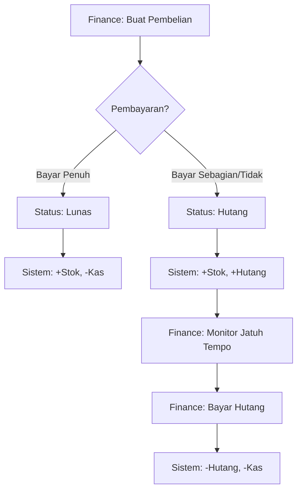
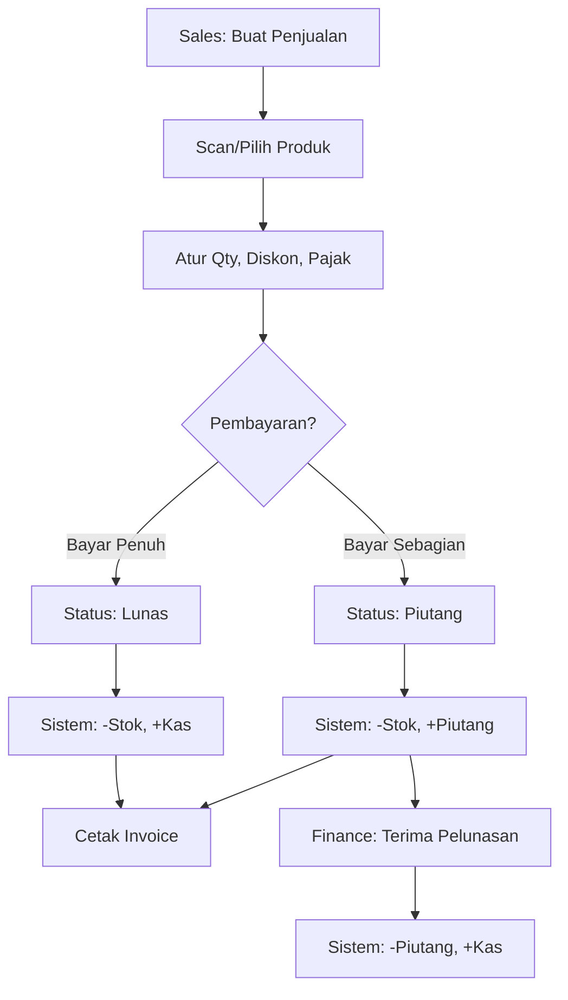
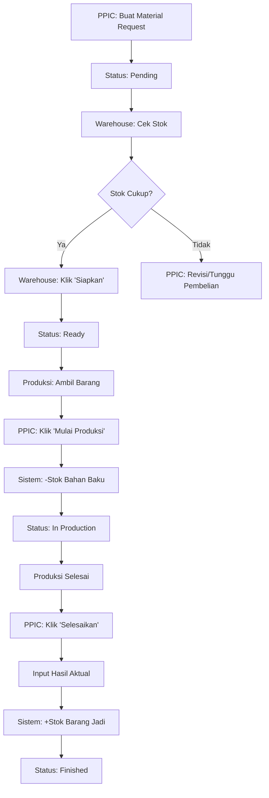

# Role & Workflow - Sistem Inventori PT NBC Indonesia

## Panduan Lengkap Tanggung Jawab & Alur Operasional

Dokumen ini menjelaskan secara detail pembagian peran (roles), izin akses (permissions), dan alur kerja lengkap (workflows) untuk setiap proses bisnis di sistem inventori PT NBC Indonesia.

---

## 📋 DAFTAR ISI

1. [Struktur Organisasi & Peran](#struktur-organisasi--peran)
2. [Matriks Hak Akses Lengkap](#matriks-hak-akses-lengkap)
3. [Alur Kerja Sistem (Workflow Integration)](#alur-kerja-sistem-workflow-integration)
4. [Spesifikasi Akses & Keamanan](#spesifikasi-akses--keamanan)
5. [Workflow Procurement (Pengadaan)](#workflow-procurement)
6. [Workflow Sales (Penjualan)](#workflow-sales)
7. [Workflow Production (Produksi)](#workflow-production)
8. [Workflow Finance (Keuangan)](#workflow-finance)
9. [Workflow Inventory Management](#workflow-inventory-management)
10. [Best Practices & SOP](#best-practices--sop)

---

## 1. STRUKTUR ORGANISASI & PERAN

### 1.1 Administrator (Super Admin)

**Peran:** Pengelola Teknis & Keamanan Sistem.  
**Kode Akses:** `admin@gmail.com`  
**Tanggung Jawab Utama:** Menjaga stabilitas aplikasi, keamanan data, dan manajemen hak akses pengguna.

-   **Manajemen Pengguna & Hak Akses:**
    -   Mendaftarkan akun karyawan baru dan menonaktifkan akun karyawan yang keluar (Resign/PHK).
    -   Mengatur level otoritas (Role) dan izin spesifik (Permissions) agar user hanya bisa mengakses menu yang relevan dengan pekerjaannya.
-   **Pemeliharaan Sistem & Audit:**
    -   Memantau History Aktivitas (`settings.logs`) untuk mendeteksi tindakan mencurigakan atau kesalahan input fatal.
    -   Memastikan fitur keamanan seperti Middleware Role dan CSRF Protection berjalan dengan baik.
    -   Melakukan pemulihan data (Restore) jika terjadi kesalahan pada data master yang terhapus (menggunakan fitur Soft Deletes).
-   **Konfigurasi Global:** Mengatur profil perusahaan, logo, dan format nomor surat jalan/faktur pada sistem.

---

### 1.2 Manajer Operasional (Manager)

**Peran:** Pengambil Keputusan Strategis.  
**Kode Akses:** `manajer@gudang.com`  
**Tanggung Jawab Utama:** Memantau kinerja operasional dan efisiensi stok melalui data real-time.

-   **Analisis Dashboard:** Memantau grafik pergerakan stok, tren penjualan, dan performa produksi melalui Dashboard Utama.
-   **Evaluasi Laporan:**
    -   Menganalisis Laporan Laba Rugi untuk mengetahui profitabilitas per periode.
    -   Mengecek laporan barang _Slow Moving_ dan _Fast Moving_ untuk strategi pengadaan selanjutnya.
-   **Persetujuan (Approval):** Memberikan persetujuan akhir untuk pembelian material jumlah besar atau penyesuaian stok bernilai tinggi.

---

### 1.3 Finance (Keuangan)

**Peran:** Pengawas Aset & Arus Kas.  
**Kode Akses:** `finance@gudang.com`  
**Tanggung Jawab Utama:** Mengelola aspek finansial dari inventory dan transaksi jual-beli.

-   **Valuasi Aset:** Memantau Laporan Valuasi Stok untuk mengetahui total nilai Rupiah aset yang mengendap di gudang.
-   **Manajemen Arus Kas:**
    -   Mencatat pembayaran masuk (Piutang) dari Customer berdasarkan data Penjualan.
    -   Mencatat pembayaran keluar (Hutang) ke Supplier berdasarkan data Pembelian.
    -   Mengelola Arus Kas dan Biaya Operasional (_expense.manage_).
-   **Audit Keuangan:** Mencocokkan data di sistem inventory dengan bukti fisik tagihan/faktur untuk mencegah kebocoran anggaran.

---

### 1.4 Kepala Gudang (Warehouse Supervisor)

**Peran:** Pengendali Mutu & Stok Fisik.  
**Kode Akses:** `supervisor@gudang.com`  
**Tanggung Jawab Utama:** Memastikan akurasi data sistem dengan fisik gudang serta memvalidasi kerja staff.

-   **Kontrol Inventaris:**
    -   Melakukan Stock Opname secara berkala dan menginput selisih stok ke dalam sistem.
    -   Menyetujui Transfer Stok antar gudang atau antar rak penyimpanan.
-   **Manajemen Retur:** Memvalidasi Retur Penjualan (dari customer) dan Retur Pembelian (ke supplier).
-   **Supervisi Staff:** Memantau aktivitas Staff Gudang melalui Jurnal Stok untuk memastikan SOP dijalankan dengan benar (Scan QR Code).

---

### 1.5 Staff Gudang (Warehouse Staff)

**Peran:** Operator Lapangan (Eksekutor).  
**Kode Akses:** `staff@gudang.com`  
**Tanggung Jawab Utama:** Mencatat keluar masuk barang fisik secara real-time.

-   **Penerimaan Barang:** Menerima barang dari supplier, memeriksa kondisi fisik, dan menginput data ke menu Pembelian Baru.
-   **Labeling:** Menempelkan label QR Code pada barang yang baru masuk.
-   **Pengeluaran Barang:**
    -   Menyiapkan barang sesuai pesanan penjualan atau permintaan produksi.
    -   Melakukan scan Pindai QR Stok (Mobile) untuk memastikan barang sesuai dan sistem otomatis mengurangi stok.
-   **Pemeliharaan Data Master:** Menambahkan data produk baru, kategori, atau satuan jika ada item baru.

---

### 1.2 Manager / Direktur

**Posisi:** Pemilik Bisnis / General Manager  
**Jumlah User:** 1-3 orang

#### Tanggung Jawab Utama:

-   Monitoring performa bisnis secara keseluruhan
-   Analisis laporan keuangan dan inventori
-   Pengawasan hutang/piutang
-   Decision making berdasarkan data

#### Hak Akses:

✅ **Dashboard:** View all dashboards (Main, Finance)  
✅ **Laporan:** View & Export semua laporan  
✅ **Master Data:** View only (tidak bisa edit/hapus)  
✅ **Transaksi:** View detail semua transaksi  
✅ **Keuangan:** View dashboard keuangan, analisis profit margin  
❌ **Pengaturan:** Tidak bisa mengubah sistem  
❌ **Delete:** Tidak bisa menghapus data apapun

#### Workflow Khusus:

-   Review laporan valuasi bulanan
-   Analisis top 10 produk terlaris vs dead stock
-   Monitoring aging piutang & hutang

---

### 1.3 Finance (Keuangan)

**Posisi:** Staff Accounting / Finance Manager  
**Jumlah User:** 1-3 orang

#### Tanggung Jawab Utama:

-   Mencatat dan memverifikasi semua transaksi keuangan
-   Mengelola hutang ke supplier
-   Mengelola piutang dari customer
-   Rekonsiliasi bank dan kas
-   Membuat laporan keuangan

#### Hak Akses:

✅ **Dashboard Keuangan:** Full access  
✅ **Pembelian:** Create, View, Bayar Hutang  
✅ **Penjualan:** View only, Terima Pembayaran Piutang  
✅ **Cash Flow:** Create, View, Edit, Delete  
✅ **Pengeluaran:** Create, View, Edit, Delete  
✅ **Laporan Keuangan:** View & Export (Valuasi, Laba Rugi)  
⚠️ **Master Data:** View only (Supplier, Customer)  
❌ **Stock Management:** Tidak bisa transfer/adjustment stok  
❌ **PPIC:** Tidak ada akses

#### Workflow Utama:

**A. Proses Pembayaran Hutang:**

1. Buka menu Keuangan → Hutang
2. Lihat daftar pembelian yang belum lunas
3. Prioritaskan yang sudah jatuh tempo (warna merah)
4. Klik detail pembelian → "Bayar Hutang"
5. Input nominal pembayaran (bisa partial/full)
6. Sistem otomatis update saldo hutang

**B. Proses Penerimaan Piutang:**

1. Buka menu Keuangan → Piutang
2. Customer menghubungi untuk bayar
3. Klik detail penjualan → "Terima Pembayaran"
4. Input nominal yang dibayar
5. Sistem update saldo piutang & saldo kas

**C. Rekonsiliasi Bulanan:**

1. Export laporan Cash Flow (Excel)
2. Bandingkan dengan rekening koran bank
3. Jika ada selisih, cek Jurnal Stok dan transaksi
4. Buat Pengeluaran manual untuk biaya yang belum tercatat

---

### 1.4 Warehouse Staff (Staff Gudang)

**Posisi:** Kepala Gudang / Admin Gudang  
**Jumlah User:** 2-5 orang (per gudang)

#### Tanggung Jawab Utama:

-   Menjaga akurasi stok fisik vs sistem
-   Penerimaan barang dari supplier
-   Pengiriman barang ke customer/produksi
-   Transfer barang antar gudang
-   Stock opname berkala

#### Hak Akses:

✅ **Master Data:** CRUD Produk, Kategori, Satuan, Gudang  
✅ **Pembelian:** View only (untuk cek barang yang akan datang)  
✅ **Transfer Stok:** Create, View, Approve  
✅ **Stock Adjustment:** Create (butuh approval Admin)  
✅ **Material Request:** View, Siapkan Barang, Fulfillment  
✅ **Laporan Stok:** View & Export (Stock Ledger, Valuasi)  
✅ **Cetak Barcode:** Full access  
❌ **Keuangan:** Tidak ada akses  
❌ **Penjualan:** Tidak bisa buat transaksi

#### Workflow Utama:

**A. Penerimaan Barang dari Pembelian:**

1. Finance/Purchasing sudah input Pembelian di sistem
2. Supplier mengirim barang fisik
3. Warehouse cek fisik vs nota pembelian
4. Jika sesuai → Sistem sudah otomatis tambah stok saat Finance save
5. Jika tidak sesuai → Hubungi Finance untuk koreksi

**B. Transfer Stok Antar Gudang:**

1. Buka menu Gudang & Stok → Transfer
2. Pilih Gudang Asal dan Gudang Tujuan
3. Pilih produk dan kuantitas
4. Klik "Simpan Transfer"
5. Sistem otomatis kurangi stok di gudang asal, tambah di gudang tujuan
6. Tercatat di Jurnal Stok dengan tipe "Transfer"

**C. Stock Adjustment (Koreksi Stok):**

1. Lakukan stock opname fisik
2. Bandingkan dengan Laporan Stok Sistem
3. Jika ada selisih:
    - Buka menu Adjustment
    - Pilih produk dan gudang
    - Input stok fisik sebenarnya
    - Tulis alasan (misal: "Rusak", "Hilang", "Salah hitung")
4. Submit untuk approval Admin
5. Setelah diapprove, stok sistem menyesuaikan

**D. Fulfillment Material Request:**

1. PPIC mengajukan Material Request
2. Warehouse menerima notifikasi
3. Cek ketersediaan stok
4. Jika tersedia → Klik "Siapkan" → Status menjadi "Ready"
5. Produksi ambil barang → Klik "Mulai Produksi"
6. Stok bahan baku otomatis berkurang

---

### 1.5 Sales / Kasir

**Posisi:** Sales Counter / Kasir Toko  
**Jumlah User:** 2-10 orang

#### Tanggung Jawab Utama:

-   Melayani transaksi penjualan
-   Input data customer baru
-   Cetak invoice dan surat jalan
-   Proses retur penjualan
-   Follow up piutang (komunikasi)

#### Hak Akses:

✅ **Penjualan:** Create, View, Edit (transaksi sendiri)  
✅ **Customer:** CRUD  
✅ **Retur Penjualan:** Create  
✅ **Cetak Invoice:** Full access  
⚠️ **Produk:** View only (untuk cek harga dan stok)  
⚠️ **Piutang:** View only (tidak bisa terima pembayaran → Finance yang input)  
❌ **Pembelian:** Tidak ada akses  
❌ **Keuangan:** Tidak ada akses  
❌ **Adjustment:** Tidak ada akses

#### Workflow Utama:

**A. Membuat Penjualan Tunai:**

1. Buka menu Penjualan → Transaksi → Buat Baru
2. Pilih Customer (atau pilih "Walk-in Customer")
3. Scan barcode / ketik nama produk di kolom pencarian
4. Produk otomatis masuk keranjang
5. Atur kuantitas
6. Input diskon (jika ada)
7. Input pajak (jika ada)
8. Di bagian pembayaran: Input jumlah bayar = Grand Total
9. Sistem hitung kembalian otomatis
10. Klik "Proses Penjualan"
11. Cetak Invoice untuk customer

**B. Membuat Penjualan Kredit (Piutang):**
1-7. (Sama seperti penjualan tunai) 8. Di bagian pembayaran: Input jumlah bayar < Grand Total 9. Sistem munculkan field "Jatuh Tempo" 10. Input tanggal jatuh tempo 11. Klik "Proses Penjualan" 12. Sistem catat selisih sebagai Piutang

**C. Proses Retur Penjualan:**

1. Customer datang dengan barang dan invoice
2. Buka menu Penjualan → Daftar Transaksi
3. Cari transaksi berdasarkan nomor invoice
4. Klik "Detail" → Klik "Proses Retur"
5. Pilih item yang diretur dan kuantitas
6. Sistem otomatis kembalikan stok
7. Sistem kurangi piutang/kas sesuai metode pembayaran awal

---

### 1.6 PPIC / Production Manager

**Posisi:** Production Planning & Inventory Control  
**Jumlah User:** 1-3 orang

#### Tanggung Jawab Utama:

-   Merencanakan jadwal produksi
-   Mengajukan kebutuhan bahan baku
-   Monitoring proses produksi
-   Analisis efisiensi pemakaian bahan

#### Hak Akses:

✅ **Material Request:** Create, View, Edit (request sendiri)  
✅ **Produksi:** Update status (Start, Finish)  
✅ **Laporan Produksi:** View & Export  
⚠️ **Produk:** View only (untuk cek ketersediaan)  
⚠️ **Laporan Stok:** View only  
❌ **Keuangan:** Tidak ada akses  
❌ **Penjualan/Pembelian:** Tidak ada akses

#### Workflow Utama:

**A. Mengajukan Material Request:**

1. Buka menu PPIC → Material Request → Buat Baru
2. Pilih produk output (barang jadi yang akan diproduksi)
3. Input target kuantitas produksi
4. Tambahkan bahan baku yang dibutuhkan:
    - Pilih item (misal: Benang Cotton)
    - Input kuantitas (misal: 100 Kg)
5. Klik "Submit Request"
6. Status: "Pending" (menunggu Warehouse siapkan)

**B. Memulai Produksi:**

1. Warehouse sudah klik "Siapkan" → Status "Ready"
2. Ambil barang fisik dari gudang
3. Buka detail Material Request
4. Klik "Mulai Produksi"
5. Status berubah menjadi "In Production"
6. Sistem otomatis kurangi stok bahan baku

**C. Menyelesaikan Produksi:**

1. Proses produksi selesai
2. Buka detail Material Request
3. Klik "Selesaikan"
4. Input hasil produksi aktual (misal: target 100 pcs, aktual 98 pcs)
5. Sistem otomatis tambah stok barang jadi
6. Status berubah "Finished"

---

## 2. MATRIKS HAK AKSES LENGKAP

### Modul: Master Data

| Fitur           | Admin | Manager | Finance | Warehouse | Sales | PPIC |
| --------------- | ----- | ------- | ------- | --------- | ----- | ---- |
| Kategori (CRUD) | ✅    | ❌      | ❌      | ✅        | ❌    | ❌   |
| Satuan (CRUD)   | ✅    | ❌      | ❌      | ✅        | ❌    | ❌   |
| Gudang (CRUD)   | ✅    | ❌      | ❌      | ✅        | ❌    | ❌   |
| Produk (Create) | ✅    | ❌      | ❌      | ✅        | ❌    | ❌   |
| Produk (View)   | ✅    | ✅      | ✅      | ✅        | ✅    | ✅   |
| Produk (Edit)   | ✅    | ❌      | ❌      | ✅        | ❌    | ❌   |
| Produk (Delete) | ✅    | ❌      | ❌      | ❌        | ❌    | ❌   |
| Supplier (CRUD) | ✅    | ❌      | ✅      | ✅        | ❌    | ❌   |
| Customer (CRUD) | ✅    | ❌      | ✅      | ❌        | ✅    | ❌   |

### Modul: Transaksi

| Fitur                      | Admin | Manager | Finance | Warehouse | Sales | PPIC |
| -------------------------- | ----- | ------- | ------- | --------- | ----- | ---- |
| Pembelian (Create)         | ✅    | ❌      | ✅      | ❌        | ❌    | ❌   |
| Pembelian (View)           | ✅    | ✅      | ✅      | ✅        | ❌    | ❌   |
| Pembelian (Edit)           | ✅    | ❌      | ✅      | ❌        | ❌    | ❌   |
| Penjualan (Create)         | ✅    | ❌      | ❌      | ❌        | ✅    | ❌   |
| Penjualan (View)           | ✅    | ✅      | ✅      | ❌        | ✅    | ❌   |
| Transfer Stok              | ✅    | ❌      | ❌      | ✅        | ❌    | ❌   |
| Stock Adjustment (Create)  | ✅    | ❌      | ❌      | ✅        | ❌    | ❌   |
| Stock Adjustment (Approve) | ✅    | ❌      | ❌      | ❌        | ❌    | ❌   |

### Modul: Keuangan

| Fitur                  | Admin | Manager | Finance | Warehouse | Sales | PPIC |
| ---------------------- | ----- | ------- | ------- | --------- | ----- | ---- |
| Dashboard Keuangan     | ✅    | ✅      | ✅      | ❌        | ❌    | ❌   |
| Hutang (View)          | ✅    | ✅      | ✅      | ❌        | ❌    | ❌   |
| Hutang (Bayar)         | ✅    | ❌      | ✅      | ❌        | ❌    | ❌   |
| Piutang (View)         | ✅    | ✅      | ✅      | ❌        | ⚠️    | ❌   |
| Piutang (Terima Bayar) | ✅    | ❌      | ✅      | ❌        | ❌    | ❌   |
| Cash Flow (CRUD)       | ✅    | ❌      | ✅      | ❌        | ❌    | ❌   |
| Pengeluaran (CRUD)     | ✅    | ❌      | ✅      | ❌        | ❌    | ❌   |

### Modul: PPIC & Produksi

| Fitur                      | Admin | Manager | Finance | Warehouse | Sales | PPIC |
| -------------------------- | ----- | ------- | ------- | --------- | ----- | ---- |
| Material Request (Create)  | ✅    | ❌      | ❌      | ❌        | ❌    | ✅   |
| Material Request (View)    | ✅    | ✅      | ❌      | ✅        | ❌    | ✅   |
| Material Request (Siapkan) | ✅    | ❌      | ❌      | ✅        | ❌    | ❌   |
| Produksi (Start/Finish)    | ✅    | ❌      | ❌      | ❌        | ❌    | ✅   |

### Modul: Laporan

| Fitur             | Admin | Manager | Finance | Warehouse | Sales | PPIC |
| ----------------- | ----- | ------- | ------- | --------- | ----- | ---- |
| Stock Ledger      | ✅    | ✅      | ❌      | ✅        | ❌    | ✅   |
| Valuasi Stok      | ✅    | ✅      | ✅      | ✅        | ❌    | ❌   |
| Laporan Penjualan | ✅    | ✅      | ✅      | ❌        | ✅    | ❌   |
| Laporan Pembelian | ✅    | ✅      | ✅      | ❌        | ❌    | ❌   |

### Modul: Pengaturan

| Fitur               | Admin | Manager | Finance | Warehouse | Sales | PPIC |
| ------------------- | ----- | ------- | ------- | --------- | ----- | ---- |
| Profil Perusahaan   | ✅    | ❌      | ❌      | ❌        | ❌    | ❌   |
| User Management     | ✅    | ❌      | ❌      | ❌        | ❌    | ❌   |
| Roles & Permissions | ✅    | ❌      | ❌      | ❌        | ❌    | ❌   |

## 3. ALUR KERJA SISTEM (WORKFLOW INTEGRATION)

Kasus: **Siklus Produksi & Penjualan**

1. **Manager** melihat stok produk jadi menipis di Dashboard.
2. **PPIC** membuat Rencana Produksi dan melakukan Permintaan Material di sistem.
3. **Staff Gudang** menerima notifikasi, menyiapkan kain, melakukan Scan QR untuk mengeluarkan bahan baku (Stok Kain Berkurang).
4. **PPIC** menyelesaikan produksi dan menginput "Produk Selesai" (Stok Baju Bertambah).
5. **Staff Gudang** memproses pengiriman ke customer via menu Penjualan (Stok Baju Berkurang).
6. **Finance** menerbitkan invoice dan mencatat pembayaran masuk di menu Keuangan.
7. **Kepala Gudang** di akhir bulan melakukan Stock Opname untuk memastikan tidak ada barang hilang selama proses.
8. **Admin** memantau Log Aktivitas untuk memastikan tidak ada data yang dimanipulasi tanpa izin.

---

## 4. SPESIFIKASI AKSES & KEAMANAN (Teknis)

Dalam menjalankan tugasnya, seluruh user terikat pada protokol keamanan sistem yang dibangun menggunakan Laravel 12:

-   **Mobile-First Usage:** Staff Gudang & Kepala Gudang diwajibkan menggunakan perangkat Mobile/Tablet saat di area gudang untuk memanfaatkan fitur Scanner QR Code secara optimal.
-   **Integritas Data (Soft Deletes):** User tidak dapat menghapus data secara permanen. Data yang dihapus (misal: Salah input produk) hanya akan disembunyikan (_Archived_) dan hanya bisa dipulihkan oleh Admin atau Supervisor untuk menjaga riwayat audit.
-   **Keamanan Akun:**
    -   Password tersimpan dengan enkripsi tingkat tinggi (**Bcrypt**).
    -   User dilarang meminjamkan akun kepada role lain untuk menjaga validitas History Aktivitas (siapa melakukan apa).

---

### 3.1 Alur Lengkap Pembelian

### 3.2 Step-by-Step Detail

**STEP 1: Finance Input Pembelian**

-   Menu: Pembelian → Buat Pembelian Baru
-   Input:
    -   Pilih Supplier
    -   Tanggal Pembelian
    -   No. Invoice Supplier (opsional)
    -   Tambah Item: Produk + Qty + Harga Beli
    -   Total akan dihitung otomatis

**STEP 2: Tentukan Status Pembayaran**

-   **Scenario A - Bayar Tunai Penuh:**
    -   Input "Jumlah Dibayar" = Total
    -   Status: Lunas ✅
-   **Scenario B - Hutang (Tempo):**
    -   Input "Jumlah Dibayar" < Total (atau 0)
    -   Sistem munculkan field "Jatuh Tempo"
    -   Input tanggal jatuh tempo
    -   Status: Hutang ⏳

**STEP 3: Sistem Eksekusi Otomatis**

-   ✅ Stok bertambah di gudang yang dipilih
-   ✅ Jurnal Stok mencatat: "Pembelian dari [Supplier]"
-   ✅ Cash Flow: Uang Keluar (jika bayar)
-   ✅ Hutang bertambah (jika belum lunas)

**STEP 4: Follow-up Hutang**

-   Finance buka menu Keuangan → Hutang
-   Filter yang sudah jatuh tempo
-   Klik "Bayar Hutang"
-   Input nominal (bisa cicil)
-   Sistem update saldo

### 3.3 Retur Pembelian

**Kondisi:** Barang rusak/tidak sesuai, dikembalikan ke supplier

1. Finance buka detail Pembelian yang akan diretur
2. Klik "Proses Retur"
3. Pilih item yang diretur + kuantitas
4. Sistem otomatis:
    - Stok barang berkurang
    - Hutang berkurang (jika belum lunas)
    - Kas bertambah (jika sudah lunas)

---

## 4. WORKFLOW SALES (Penjualan)

### 4.1 Alur Lengkap Penjualan

### 4.2 Step-by-Step Detail

**STEP 1: Sales Buat Transaksi**

-   Menu: Penjualan → Transaksi → Buat Baru
-   Pilih Customer (atau Walk-in)
-   Tambah produk ke keranjang

**STEP 2: Kalkulasi Harga**

-   Subtotal dihitung otomatis
-   Input Diskon (% atau nominal)
-   Input Pajak (% atau nominal)
-   Grand Total = Subtotal - Diskon + Pajak

**STEP 3: Proses Pembayaran**

-   **Scenario A - Tunai:**
    -   Input "Jumlah Dibayar" ≥ Grand Total
    -   Sistem hitung kembalian
    -   Status: Lunas ✅
-   **Scenario B - Kredit:**
    -   Input "Jumlah Dibayar" < Grand Total
    -   Input "Jatuh Tempo"
    -   Selisih = Piutang
    -   Status: Piutang ⏳

**STEP 4: Sistem Eksekusi**

-   ✅ Stok berkurang
-   ✅ Jurnal Stok: "Penjualan ke [Customer]"
-   ✅ Cash Flow: Uang Masuk (jika bayar)
-   ✅ Piutang bertambah (jika kredit)

**STEP 5: Cetak Invoice**

-   Klik "Cetak Invoice"
-   Format profesional dengan logo
-   Berikan ke customer

### 4.3 Retur Penjualan

1. Customer datang dengan barang rusak
2. Sales cari transaksi asli
3. Klik "Proses Retur"
4. Pilih item + qty yang diretur
5. Sistem otomatis:
    - Stok kembali
    - Piutang berkurang (jika kredit)
    - Kas berkurang (jika tunai → refund)

---

## 5. WORKFLOW PRODUCTION (Produksi)

### 5.1 Alur Material Request (PPIC to Warehouse to Production)

### 5.2 Step-by-Step Detail

**STEP 1: PPIC Mengajukan Request**

-   Menu: PPIC → Material Request → Buat Baru
-   Pilih Produk Output (barang jadi)
-   Target Qty (misal: 100 pcs Kain)
-   Tambah Bahan Baku:
    -   Benang Cotton: 50 Kg
    -   Zat Pewarna: 5 Liter
-   Klik "Submit"
-   Status: **Pending** ⏳

**STEP 2: Warehouse Verifikasi**

-   Warehouse menerima notifikasi
-   Cek ketersediaan fisik
-   **Jika stok cukup:**
    -   Siapkan barang fisik
    -   Klik "Siapkan" di sistem
    -   Status → **Ready** ✅
-   **Jika stok tidak cukup:**
    -   Tolak request (dengan alasan)
    -   PPIC revisi atau tunggu pembelian

**STEP 3: Produksi Mulai**

-   Produksi ambil barang dari gudang
-   PPIC klik "Mulai Produksi"
-   **Sistem otomatis:**
    -   Stok Benang Cotton: -50 Kg
    -   Stok Zat Pewarna: -5 Liter
    -   Jurnal Stok: "Digunakan untuk produksi [Nama Kain]"
-   Status → **In Production** 🔄

**STEP 4: Produksi Selesai**

-   PPIC klik "Selesaikan"
-   Input hasil aktual (misal: 98 pcs, karena 2 reject)
-   **Sistem otomatis:**
    -   Stok Kain Jadi: +98 pcs
    -   Jurnal Stok: "Hasil produksi dari Material Request #XXX"
-   Status → **Finished** ✅

---

## 6. WORKFLOW FINANCE (Keuangan)

### 6.1 Monitoring Dashboard Keuangan

**Aktivitas Harian Finance:**

1. Buka Dashboard Keuangan
2. Cek KPI Cards:
    - Saldo Kas saat ini
    - Net Movement hari ini
    - Piutang Overdue (prioritas)
    - Hutang Overdue (prioritas)
3. Analisis Grafik Arus Kas 6 Bulan
4. Cek Distribusi Pengeluaran

### 6.2 Workflow Hutang (Accounts Payable)

**Goal:** Lunasi hutang sebelum jatuh tempo

1. **Identifikasi Prioritas:**

    - Buka menu Keuangan → Hutang
    - Sort by Jatuh Tempo (ascending)
    - Hutang warna **merah** = overdue (prioritas tinggi)
    - Hutang warna **kuning** = mendekati jatuh tempo

2. **Proses Pembayaran:**

    - Klik detail pembelian
    - Cek total hutang dan riwayat pembayaran
    - Klik "Bayar Hutang"
    - Input nominal pembayaran
    - Upload bukti transfer (opsional)
    - Klik "Simpan"

3. **Verifikasi:**
    - Saldo hutang otomatis berkurang
    - Cash Flow tercatat "Uang Keluar - Bayar Hutang"
    - Jika lunas → Status pembelian berubah "Lunas"

### 6.3 Workflow Piutang (Accounts Receivable)

**Goal:** Terima pembayaran piutang sesuai jatuh tempo

1. **Identifikasi Prioritas:**

    - Buka menu Keuangan → Piutang
    - Filter yang sudah jatuh tempo
    - Hubungi customer untuk penagihan

2. **Terima Pembayaran:**

    - Customer transfer/bayar tunai
    - Finance klik detail penjualan
    - Klik "Terima Pembayaran"
    - Input nominal yang diterima
    - Upload bukti transfer
    - Klik "Simpan"

3. **Verifikasi:**
    - Saldo piutang berkurang
    - Saldo kas bertambah
    - Jika lunas → Status penjualan "Lunas"

### 6.4 Rekonsiliasi Cash Flow

**Frekuensi:** Bulanan atau akhir periode

1. Export Laporan Cash Flow (Excel)
2. Bandingkan dengan:
    - Rekening koran bank
    - Kas fisik (petty cash)
3. Jika ada selisih:
    - Cek transaksi yang mungkin terlewat
    - Tambahkan manual via menu "Pengeluaran" atau "Cash Flow"
4. Pastikan saldo sistem = saldo bank + kas fisik

---

## 7. WORKFLOW INVENTORY MANAGEMENT

### 7.1 Stock Opname (Audit Fisik)

**Frekuensi:** Bulanan/Quarterly  
**PIC:** Warehouse Staff + Auditor

**Langkah-langkah:**

1. **Persiapan:**

    - Cetak Laporan Valuasi / Stock Ledger summary
    - Siapkan form counting manual
    - Tentukan tim counter

2. **Pelaksanaan:**

    - Hitung fisik barang di rak per SKU
    - Catat hasil di form
    - Bandingkan dengan laporan sistem

3. **Identifikasi Selisih:**

    - Jika sistem 100, fisik 98 → Selisih -2
    - Cek apakah ada transaksi yang belum terinput

4. **Koreksi:**

    - Warehouse buat Stock Adjustment
    - Input stok fisik sebenarnya (98)
    - Tulis alasan: "Stock Opname - Selisih Fisik"
    - Submit untuk approval Admin

5. **Approval:**

    - Admin review alasan
    - Jika wajar → Approve
    - Sistem update stok = 98

6. **Dokumentasi:**
    - Simpan form counting fisik
    - Export laporan adjustment
    - Archive untuk audit trail

### 7.2 Reorder Point (Alert Stok Minimum)

**Goal:** Tidak kehabisan stok barang penting

1. **Setting Stok Minimum:**
    - Edit produk
    - Isi field "Stok Minimum" (misal: 10 Kg)
2. **Monitoring:**

    - Dashboard utama menampilkan "Low Stock Alert"
    - Daftar barang yang stoknya < minimum

3. **Aksi:**
    - Finance/Purchasing buat Pembelian
    - Order ke supplier sebelum stok habis

---

## 8. BEST PRACTICES & SOP

### 8.1 Data Entry Best Practices

**SKU Naming Convention:**

-   Format: `[KATEGORI]-[JENIS]-[NOMOR]`
-   Contoh: `BNG-CTN-001` (Benang Cotton nomor 001)
-   Gunakan huruf kapital, hindari spasi

**Customer Data:**

-   Selalu isi minimal: Nama, No. Telp
-   Jika retail kecil gunakan "Walk-in Customer" umum
-   Update alamat untuk pengiriman

**Supplier Data:**

-   Isi lengkap: Nama, Alamat, PIC, Telp, Email
-   Catat termin pembayaran biasa (30/60 hari)

### 8.2 Security Best Practices

**Password Policy:**

-   Minimal 8 karakter
-   Kombinasi huruf, angka, simbol
-   Ganti setiap 3 bulan

**Akses Kendali:**

-   Jangan share username/password
-   Logout setelah selesai (terutama shared PC)
-   Laporkan aktivitas mencurigakan ke Admin

**Backup Data:**

-   Admin backup database setiap minggu
-   Simpan di cloud atau external drive
-   Test restore 1x per bulan

### 8.3 Troubleshooting Common Issues

**Issue: "Stok tidak mencukupi"**

-   Cek stok di gudang yang benar
-   Pastikan tidak ada transaksi pending
-   Lakukan refresh halaman

**Issue: "Data tidak muncul di laporan"**

-   Cek filter tanggal
-   Pastikan data sudah disimpan (bukan draft)
-   Refresh atau export ulang

**Issue: "Invoice tidak muncul logo"**

-   Admin upload logo di Pengaturan → Profil Perusahaan
-   Format: PNG/JPG, max 2MB
-   Recommended size: 200x80px

---

## 9. CONTACT & ESCALATION

### Level 1 Support: FAQ & User Manual

-   Baca panduan di menu Help Center
-   Cek dokumentasi ini

### Level 2 Support: Admin Internal

-   Hubungi Admin IT perusahaan
-   Email: admin@ptNBC.co.id

### Level 3 Support: Developer/Vendor

-   Untuk bug/error sistem
-   Email: support@vendor.com
-   Sertakan screenshot error

---

**Dokumen Terakhir Diperbarui:** 30 Desember 2025  
**Versi:** 2.0  
**Penyusun:** PT NBC Indonesia IT Department

---

_"Sistem yang baik adalah sistem yang digunakan dengan benar oleh orang yang tepat"_
